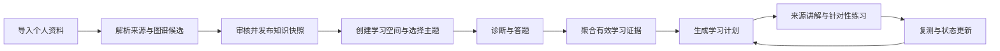
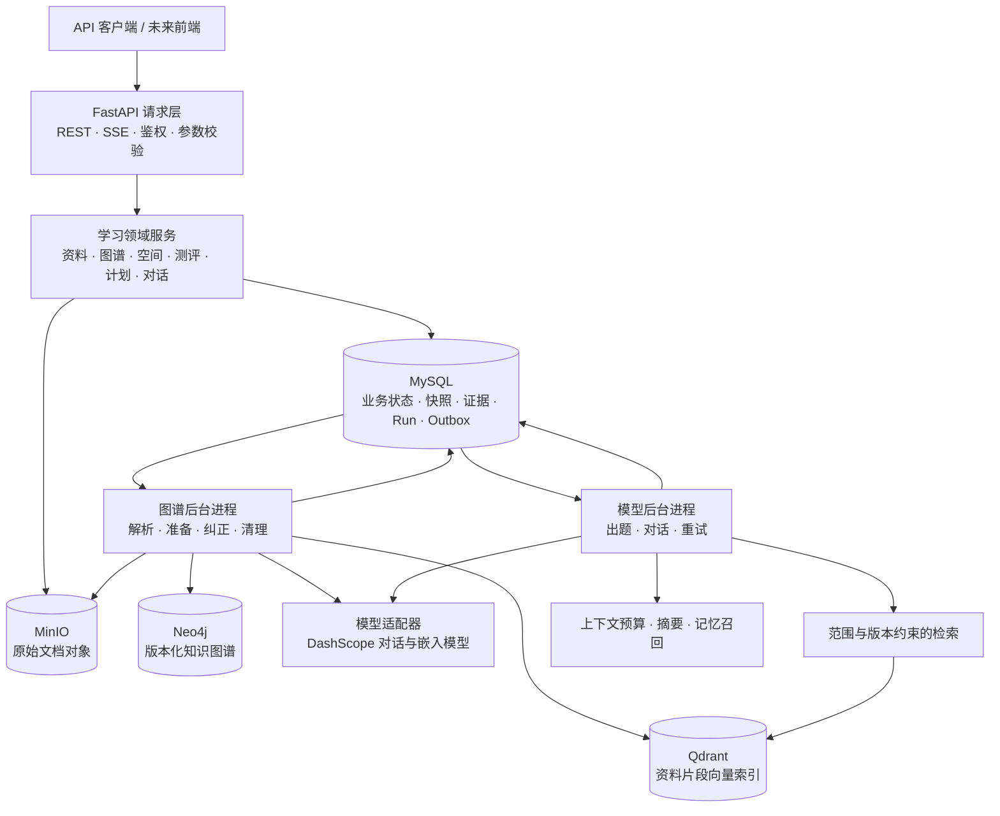
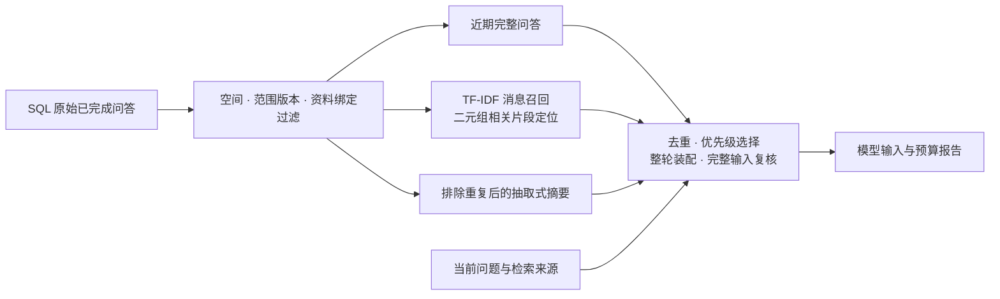

# KnowPath

**基于个人资料、知识图谱与学习证据的自适应学习系统。**

KnowPath 将用户自己的教材、笔记和文档组织成可追溯的知识结构，通过诊断、练习和复测识别学习状态，再结合前置知识与时间预算生成学习安排。分层记忆与上下文编排让讨论能够延续，同时控制历史信息的范围、重复与输入成本。资料、题目、回答和掌握度之间保留来源与版本关联，让“学什么、为什么学、是否学会”都有可查询的依据。

当前已实现面向本地单用户的 Python Web 后端，提供 REST API、SSE 事件流和两个持久化后台任务进程。`frontend/` 为预留目录，尚未实现前端界面。

[产品功能](#产品功能) · [系统架构](#系统架构) · [算法与策略亮点](#算法与策略亮点) · [快速启动](#快速启动) · [验证与当前边界](#验证与当前边界)

## 产品功能

### 从资料到复测的学习闭环



| 能力 | 用户可以做什么 | 系统保留什么 |
| --- | --- | --- |
| 资料管理 | 上传文本型 PDF、Markdown、TXT，追加版本、查看来源、删除资料 | 原始文件、内容哈希、来源片段、章节与页码或行号 |
| 知识图谱 | 查看主题结构、审核关系候选、比较版本差异、确认纠正并发布 | 关系依据、审核状态、不可变图谱快照与发布记录 |
| 学习空间 | 绑定已发布资料，设置学习目标、主题范围、时间预算与偏好 | 资料绑定、范围版本和用户确认的档案 |
| 诊断与复测 | 生成诊断、练习或复测题，提交答案，查看结果与评分复核 | 题目快照、答案修订、评分与学习证据 |
| 学习计划 | 根据当前状态安排学习、针对性练习和复习，管理任务与会话 | 任务选择理由、时间安排、完成历史与计划版本 |
| 资料问答 | 在当前学习范围内提问，查看回答引用，延续历史讨论 | 来源引用、对话记录、受范围约束的记忆 |
| 学习记忆 | 在同一学习空间和知识范围内接续历史问题，召回其他会话的相关讨论 | 已完成的原始问答、摘要来源与召回消息标识 |
| 更新与追溯 | 显式采用知识更新，查看变更、重置学习状态或导出学习空间 | 历史证据、状态变化和导出快照 |
| 异步任务 | 查询任务进度、订阅事件、断线后续接或请求取消 | 持久化运行记录、事件序列和后台任务状态 |

知识内容与学习者状态分别管理：资料更新不会直接覆盖历史测评证据，聊天中的一句“我会了”也不会直接把知识点标记为已掌握。

## 系统架构

### 运行组件与数据流



| 层次 | 职责与实现 |
| --- | --- |
| 请求层 | `learning/api/` 负责路由、每应用依赖、错误映射、来源白名单、本地令牌和幂等键检查 |
| 业务层 | 按资料、空间、测评、计划、对话、知识图谱分组；`state.py` 保留现有服务装配与业务门面 |
| 模型与检索 | `providers/` 封装模型协议与能力校验，`rag/` 提供向量索引及候选来源检索 |
| 持久化层 | `persistence/` 集中 SQLAlchemy ORM、仓储与共享工作单元；Alembic 管理结构演进 |
| 后台执行 | `workers/` 消费持久化任务，处理租约、重试、取消与结果发布 |
| Agent 基座 | 保留模型客户端、上下文、记忆、工具、规划、验证和评测组件；Web 对话复用其中的上下文与记忆能力 |

### 四种存储各自负责什么

- **MySQL 是业务事实来源。** 保存资料元数据、对象引用、来源、图谱快照、学习空间、测评证据、计划、消息、导出和任务事件。当前 HTTP 图谱查询读取 MySQL 中的版本快照。
- **MinIO 保存原始文档。** 新上传文件按资料版本存入私有桶，解析任务从对象存储读取；旧 SQL 文件兼容读取并支持显式迁移。部署配置见 [基础服务说明](infra/README.md#minio-文档存储)。
- **Neo4j 保存版本化图谱。** 图谱后台进程准备节点与关系，并在发布前验证；不能将其理解为所有 Web 查询都直接访问的数据库。
- **Qdrant 保存可重建的向量索引。** 负责相似度检索，来源正文和候选边界仍以业务快照为准。

跨进程任务通过 MySQL 中的 Outbox 记录衔接业务事务与后台执行，当前不依赖独立消息队列。SQL 仓储共享工作单元；外部模型和索引调用通过任务及准备记录协调，不构成跨 MySQL、Neo4j、Qdrant 的单一数据库事务。

### 项目目录

```text
KnowPath/
├── frontend/                     # 前端预留目录
├── py/                           # Python 后端与 .venv
│   ├── knowpath_backend/
│   │   ├── learning/
│   │   │   ├── api/              # 应用装配、鉴权、校验和业务路由
│   │   │   ├── materials/        # 上传、解析、来源和删除
│   │   │   ├── spaces/           # 空间、档案、时间线和导出
│   │   │   ├── assessments/      # 出题、评分、证据和掌握度
│   │   │   ├── plans/            # 约束规划、任务和学习会话
│   │   │   ├── conversations/    # 回答生成和对话上下文
│   │   │   ├── knowledge/        # 图谱、关系、纠正和知识更新
│   │   │   ├── rag/              # 检索和向量索引
│   │   │   ├── providers/        # 模型适配
│   │   │   ├── persistence/      # ORM、仓储和工作单元
│   │   │   └── workers/          # 持久化后台任务
│   │   ├── agents/ core/         # Agent 执行与通用运行基础
│   │   ├── context/ memory/      # 上下文和记忆组件
│   │   ├── planning/ tools/      # 通用规划与工具能力
│   │   ├── verify/ tdd/ workspace/ bench/
│   │   └── test/                 # 后端与 Agent 基座回归测试
│   ├── migrations/               # Alembic 数据库迁移
│   └── scripts/                  # 初始化与隔离验收脚本
├── docs/                         # 架构、接口及实现记录
└── infra/                        # MySQL、Neo4j、Qdrant、MinIO 容器配置
```

## 算法与策略亮点

以下描述对应当前代码中的实现。技术亮点集中在证据驱动学习、约束规划、分层记忆和预算约束的上下文编排。这里介绍可复现的机制及其组合方式；算法原创性与学习效果提升需要分别通过相关工作比较和对照实验验证。

### 1. 用独立证据判定掌握度

`mastery-v1` 先过滤无效、受辅助或不属于当前知识修订的证据，再按题族去重，保留每个题族最早的有效证据，最多取最近 20 个题族。当前掌握度分数为这些证据得分的算术平均值。

默认标记为“已掌握”需要同时满足：

- 平均得分至少为 `0.8`。
- 至少来自 `3` 个独立题族和 `2` 次测评。
- 证据时间跨度至少为 `24` 小时。
- 至少包含一道应用题。

这些规则用于限制重复刷同类题、短时集中作答或查看帮助带来的证据偏差。状态保留使用的证据 ID、知识修订和策略版本，便于解释与复核。当前实现是均分加门槛规则，不是训练得到的知识追踪模型。

实现：[掌握度聚合](py/knowpath_backend/learning/assessments/mastery.py) · [证据生成与辅助标记](py/knowpath_backend/learning/assessments/service.py)

### 2. 前置关系优先的约束规划

规划器先检查缺失前置知识和依赖环，再采用 Kahn 式拓扑遍历，仅在前置节点已排入序列的候选中比较优先级。排序考虑复习到期、掌握不稳定、错误标签和历史测评时间，保证依赖知识点排在其前置知识之后；排序本身不代表用户已经掌握前置知识。

任务生成后，根据每次会话时长、会话数量、周时间预算和目标日期安排日程。计划侧的默认复习间隔为 `1 / 3 / 7` 天，随有效测评次数选择档位。无法满足约束时返回冲突原因和可调整项，而不是生成超预算的安排。重建计划时保留完成、跳过等历史记录与任务来源。

实现：[依赖检查与优先级排序](py/knowpath_backend/learning/plans/service.py) · [任务策略与日程约束](py/knowpath_backend/learning/plans/policy.py)

### 3. 可审核的知识关系与版本演进

当前图谱提取利用章节结构，以及资料中明确写出的“前置知识”“相关主题”等声明。非结构关系先作为候选保存；只有经过确认、具有有效来源且不存在循环依赖的前置关系，才进入自动规划使用的关系投影。

资料和图谱以快照发布，学习空间显式绑定版本。采用新知识版本时，受影响的学习状态与任务可以标记为需要重新验证，同时保留旧证据和历史记录。当前没有把章节顺序直接推断为前置关系，也未实现任意资料间的全自动语义融合。

实现：[关系提取与安全投影](py/knowpath_backend/learning/knowledge/relations.py) · [图谱比较与发布](py/knowpath_backend/learning/knowledge/reconciliation.py) · [知识更新采用](py/knowpath_backend/learning/knowledge/updates.py)

### 4. 面向学习场景的分层记忆与两阶段召回

Web 对话将持久保存的原始消息投影为三类上下文，分别承担对话连续性、历史检索和压缩职责：

| 记忆组成 | 当前策略 | 解决的问题 |
| --- | --- | --- |
| 近期问答 | 保留当前会话最近 5 轮完整问答，作为上下文候选 | 延续当前问题，保留用户问题与回答的对应关系 |
| 相关历史 | 从其余合格消息中用 TF-IDF 选取最多 5 条，再按查询相关性抽取局部片段 | 找回其他会话或较早讨论中的相关信息 |
| 历史摘要 | 从当前会话较早且未被召回的消息中，最多取 8 轮构建抽取式摘要 | 压缩历史脉络，避免同一轮消息同时出现在近期历史、召回和摘要中 |

记忆检索分为“消息选择”和“片段定位”两个阶段。第一阶段使用包含英文词项、中文单字及双字组合的 TF-IDF 检索；第二阶段在命中消息内部按句子和滑动窗口切分，使用字符二元组相关性选择片段。这样可以定位长消息后半部分的相关内容，而不是只截取开头。

所有候选先通过学习空间、范围版本、资料绑定和完成状态过滤。摘要与召回均从原始问答构建，不把上一次派生的摘要再次作为原始记忆递归索引；每条召回保留消息及会话标识，摘要保留来源消息列表。服务重启后从 SQL 恢复原始记录并重建召回，抽取式摘要和当前历史召回不增加模型调用。

实现：[记忆投影与片段定位](py/knowpath_backend/learning/conversations/context.py) · [TF-IDF 检索后端](py/knowpath_backend/memory/backends/inmemory.py)

### 5. 证据优先、整轮装配的上下文预算策略

记忆层决定有哪些信息可用，上下文编排层决定本次模型调用实际携带哪些信息。Web 对话采用以下装配顺序：

1. **预留当前任务与资料依据。** 先估算系统提示、当前问题和业务快照的输入占用；必要时减少来源数量、裁剪来源正文，并至少保留一个来源。核心输入仍无法容纳时返回 `CONTEXT_BUDGET_EXCEEDED`。
2. **在剩余预算中选择记忆。** 默认优先级为近期完整问答、相关历史、摘要；近期问答中较新的轮次优先。候选按完整问答轮次装配，避免只留下回答而丢失问题。
3. **消除重复并复核完整输入。** 通用引擎进行文本归一化、相同内容及包含关系去重，按优先级贪心选取；Web 层每次加入候选后再估算完整序列化输入，超过预算就撤销该候选。
4. **保存可检查的预算结果。** 消息快照记录预算、估算用量、去重数以及被丢弃的来源和上下文数量，便于定位长对话中的信息取舍。

默认预算为 `16000` 个估算词元。该机制是确定性的预算分配与校验，不是求解全局最优组合；计数也不等同于模型服务商的精确分词结果。



实现：[Web 预算装配](py/knowpath_backend/learning/conversations/context.py) · [通用上下文引擎](py/knowpath_backend/context/engine.py)

### 6. 记忆、检索原文与学习证据分离

记忆参与回答时始终作为不可信用户数据传入，不提升为系统指令，也不直接修改学习成绩或掌握度。学习状态通过独立的答题、评分和证据聚合流程更新，避免把历史聊天内容当作已经验证的学习成果。

对话任务同时区分完整检索候选与本轮裁剪后的提示来源：`retrieval_sources` 保留原文供任务重试使用，但不进入模型提示。上下文压缩不会改写下一次重试所用的候选正文，从而保留依赖内容哈希的向量标识。发布回答前还会检查学习范围及资料绑定是否变化，防止旧任务结果写入已变化的学习上下文。

实现：[对话任务与快照检查](py/knowpath_backend/learning/conversations/service.py) · [上下文隔离与重试回归](py/knowpath_backend/test/test_learning_conversation_context.py)

### 通用 Agent 记忆基座的扩展能力

项目还包含完整的 L0–L5 记忆组件，分别管理长期核心信息、工作记忆、摘要、召回缓冲、冷存储和语义索引：

| 层级 | 职责 |
| --- | --- |
| L0 核心记忆 | 跨会话记忆卡片、显式固定与生命周期管理 |
| L1 工作记忆 | 当前活跃消息及容量管理 |
| L2 摘要记忆 | 对话压缩，以及可配置的摘要校正 |
| L3 召回缓冲 | 暂存召回结果，按命中条件控制晋升 |
| L4 冷存储 | 原始记忆归档，支持 JSONL 或 SQLite 后端 |
| L5 语义索引 | 可配置的向量或 TF-IDF 检索 |

这些组件提供记忆晋升、衰减、冲突检测与摘要维护的扩展基础。当前 Web 学习管线接入的是前述 SQL 消息投影、摘要、TF-IDF 召回和上下文引擎，没有直接启用整套 `MemoryManager` 的自动核心记忆晋升与维护流程。

实现：[记忆调度器](py/knowpath_backend/memory/manager.py) · [摘要组件](py/knowpath_backend/memory/summary.py) · [召回缓冲](py/knowpath_backend/memory/recall_buffer.py)

## 快速启动

需要 Python 3.13 或更高版本、uv 和已启动的 Docker。默认对话模型为 DashScope `qwen-plus`，嵌入模型为 `text-embedding-v3`，维度为 1024。

### 1. 启动存储并安装依赖

在项目根目录执行：

```powershell
docker compose -f .\infra\docker-compose.yml up -d
cd py
uv sync --locked
if (-not (Test-Path .env)) { Copy-Item .env.example .env }
```

在 `py/.env` 中填写 `DASHSCOPE_API_KEY`，确认 MySQL、Neo4j 和 Qdrant 连接参数，并使用 `LEARNING_PERSISTENCE=sql`、`LEARNING_RETRIEVAL_BACKEND=qdrant`。已有配置应保留；不要将 `.env` 或模型密钥提交到仓库。

### 2. 应用数据库迁移

在 `py/` 中执行：

```powershell
uv run alembic upgrade head
```

Alembic 读取 `alembic.ini` 同目录的 `.env`，进程环境变量优先。SQL 模式启动不会自动建表，正常安装和升级使用迁移流程。

### 3. 启动 API 与两个后台进程

在三个终端分别执行，工作目录均为 `py/`：

```powershell
uv run python -m uvicorn knowpath_backend.learning.main:app --host 127.0.0.1 --port 8000
uv run python -m knowpath_backend.learning.graph_worker_cli
uv run python -m knowpath_backend.learning.model_worker_cli
```

也可以用 PyCharm 打开整个 `KnowPath/`，选择解释器 `py/.venv/Scripts/python.exe`，运行 `.run/` 中的 **KnowPath Backend** 组合配置。该配置只启动三个后端进程，Docker 和迁移需要提前准备；其他操作系统需调整解释器路径。

| 入口 | 地址与说明 |
| --- | --- |
| API 文档 | http://127.0.0.1:8000/docs |
| 健康检查 | http://127.0.0.1:8000/api/v1/health |
| Neo4j 管理页面 | http://localhost:7474 |
| Qdrant 管理页面 | http://localhost:6333/dashboard |
| MySQL | 数据库客户端连接 `127.0.0.1:3306`，不是 HTTP 网页 |

业务请求需要 `X-Local-Token`：设置 `LEARNING_LOCAL_TOKEN`，或读取服务自动生成的 `py/.learning-token.local`。浏览器来源需匹配 `LEARNING_ALLOWED_ORIGINS`，写入接口按契约提供 `Idempotency-Key`。未认证的健康检查仅返回基本状态。详细参数和请求示例见 [接口文档](docs/API.md)。

## 验证与当前边界

最近一次目录重构验收记录为 **1367 项测试通过、217 项跳过**，覆盖学习业务与保留的 Agent 基座；49 个 HTTP 操作的 OpenAPI 快照及数据库结构快照保持一致。真实 DashScope 模型与临时 MySQL、Neo4j、Qdrant 容器的验收覆盖了资料发布、诊断、计划、对话、SSE 续接、后台任务恢复和复测证据持久化，详见 [验收记录](docs/implementation/2026-09-19-backend-layout.md)。

在 `py/` 中运行普通回归：

```powershell
$env:PYTHON_DOTENV_DISABLED = "1"
uv run python -m pytest .\knowpath_backend\test -q
Remove-Item Env:PYTHON_DOTENV_DISABLED
```

外部存储测试仅在设置相应 `LEARNING_TEST_*` 变量时执行，这些变量只能指向独立测试库。真实验收可执行 `uv run python scripts/accept_learning_backend.py --live`，会进行有限次数的付费模型调用，并自动创建与清理临时容器。

当前产品边界：

- 面向本地单用户，前端、多用户权限和在线计费尚未实现；容器配置用于本地开发。
- 支持文本型资料；不提供 OCR、扫描 PDF、音视频解析。单文件上限为 20 MiB，PDF 页数上限为 300。
- 单选题按封存答案确定性判分；开放题尚无可靠自动评分时保留为未验证，不直接形成掌握证据。
- 已实现的是可复现的规则与策略组合；尚无对照实验支持“显著提升学习效果”等结论，也没有训练新的基础大模型。
- 对话召回目前按请求重建 TF-IDF 索引，大规模历史记录下仍需评估索引与性能优化。
- 完整 Agent 基座保留，但 Web API 不开放任意 Shell、系统文件编辑或完整通用工具执行循环。

## 文档与许可

- [架构文档](docs/ARCHITECTURE.md)：领域模型、系统边界与设计决策。
- [接口文档](docs/API.md)：资源、请求响应、版本、幂等和状态约束。
- [后端说明](py/README.md)：环境、启动、配置及代码导航。
- [基础服务说明](infra/README.md)：容器、端口与存储管理。
- [数据库迁移说明](py/migrations/README.md)：结构升级与初始化方式。

许可条款与版权声明见 [LICENSE](py/LICENSE)。
