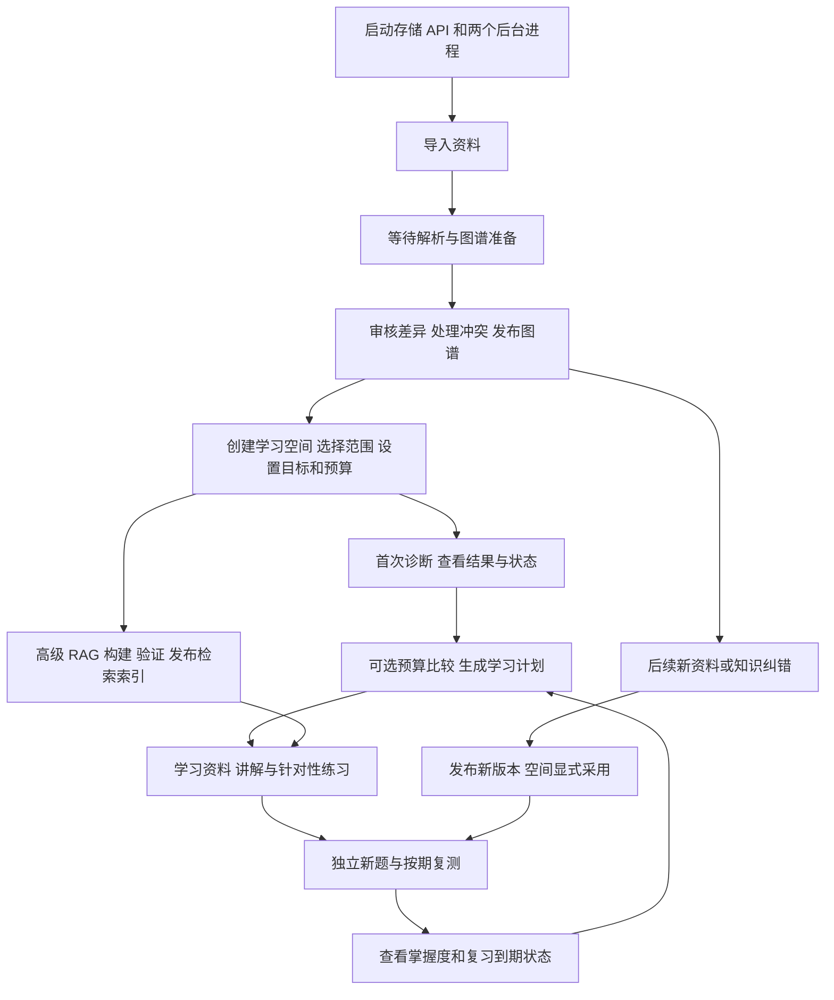

# KnowPath 后端功能清单与系统使用顺序

> 更新提示：后端清单保留 2026-10-08 的静态核对范围；网页说明于 2026-10-09 同步为当前单一前端、自动本地鉴权与真实后端功能。最新操作入口见 frontend/README.md。

核对日期：2026-10-08。范围：当前工作区源码、API 路由、前端调用和部署说明，包括尚未提交的现有代码。本次为静态核对，没有启动服务、调用模型或重新执行端到端验收。

当前后端路由声明了 **57 个 HTTP 操作**，统一位于 `/api/v1`。下面的“已实现”指源码中存在相应路由和业务处理；实际部署是否可用仍取决于配置、存储、迁移、后台进程及外部模型。README 中“49 个操作”“前端尚未实现”属于旧描述。

## 一、按模块汇报

| 模块 | 当前已实现的功能 | 使用条件与边界 |
| --- | --- | --- |
| 1. 资料管理与解析 | 上传、分页列表、详情、追加版本、版本历史、名称修改、归档、删除；保存原文件、内容哈希、章节、页码或行号、解析片段 | 支持文本型 PDF、Markdown、TXT；单文件 20 MiB，PDF 最多 300 页，文本使用 UTF-8。没有 OCR；原文件已保存，但没有公开的原文件下载接口 |
| 2. 知识图谱 | 构建主题结构、查询主题与局部图谱、准备版本、比较差异、审核发布、处理冲突、保留历史快照；同步准备 Neo4j 与 Qdrant 并回读核验 | 普通上传自动解析和准备，仍需审核发布。能看到主题预览不代表已发布。HTTP 图查询当前读取 SQL 快照 |
| 3. 学习空间与档案 | 列表、创建、详情、修改、归档、删除；绑定资料、选择/排除主题、补充强前置；设置目标、每周时间预算、目标日期和讲解偏好；查看并确认推断候选 | 每空间 1–5 份资料，每份必须有已发布图谱。绑定版本固定。目标、范围和档案具有独立版本控制 |
| 4. 测验与评分 | 诊断、练习、复测；按范围生成题目、题型及难度比例；答题、答案修订、结束测验、结果与逐题反馈；生成学习证据 | 每次 5–10 题，支持单选与简答。单选按封存答案判分；简答当前为 unverified，不计掌握分。三类名称本身不强制完整教学流程 |
| 5. 自适应诊断 | 在冻结且验证过的题池中逐题选择；优先证据不足、薄弱主题和前置排查；题族曝光去重、过程决策与结束理由 | 必须开启 adaptive。不能无限生成新题；题池耗尽可能提前结束。前置缺口是观察假设，不是已证实的错误因果 |
| 6. 证据、掌握度与复习 | 查询证据、有效性、当前状态、错误标签、证据充分性、复习到期时间；按题族去重、版本和重置周期过滤；支持状态重置 | assisted、未验证、旧知识修订、旧周期及撤销证据不作为当前独立掌握证据。任务完成不直接改变掌握结论 |
| 7. 掌握度演化 | 按主题返回状态、曲线、事件、复核和重置历史；区分真实作答时间、首次评分时间和后续修订视角 | 只读报告，有限量与截断标记；均分不是校准后的掌握概率 |
| 8. 学习计划与任务 | 根据强前置、学习状态、到期复习和时间约束初建计划；局部重排、版本保存；任务完成、跳过、延期 | 诊断是推荐前置，并非硬要求。计划变化会标记 needs_replan，重排须显式调用；无法满足约束时返回原因 |
| 9. 学习会话 | 从计划任务开始会话、查看任务上下文；记录打开资料、解释、提示、暂停、恢复；结束会话 | 每空间最多一个活动会话。结束会话、完成任务、掌握知识是三件不同的事。当前只返回墙钟经过时间，未可靠计算净学习时长 |
| 10. 资料问答与对话记忆 | 绑定版本和范围内的来源问答、连续讨论、回答引用、SSE 事件、取消；SQL 保存消息；近期历史、跨会话相关片段和抽取式摘要 | 消息创建响应返回 Run，答案通过事件获得。同会话生成中不能再发新消息。当前没有公共聊天历史列表/读取接口 |
| 11. 版本化 RAG 与引用解析 | 混合检索、融合、重排、上下文预算、原文跨度、独立答案语义核验及至多一次修正；普通、树、章节、续接、单元和导航插件；引用解析回原文 | 高级链路需显式选择插件并发布可用索引。legacy 只做引用结构/合法性验证。各插件不是同时默认执行，语义核验也不保证答案绝对正确 |
| 12. 评分与题目复核 | 评分按既有有效标准重算；题目举报后隔离，人工确认更正、作废或驳回；撤销/替代证据并重算状态 | 完成测验后才可复核，自适应未展示题不可复核。投诉不等于更正；复核不能绕过简答未验证的限制 |
| 13. 知识纠错与更新采用 | 对节点/关系提出并确认纠错；查询发布差异、可用更新、受影响主题/题目/计划；显式采用知识版本，记录变化 | 发布新知识不自动切换已有空间。更新只能替换原材料版本，不能借此增删空间材料或回退版本；受影响状态需复测，计划需重排 |
| 14. 时间预算比较 | 在同一学习快照上比较 2–5 个不同的每日预算，输出排期、覆盖、阻塞和延期原因；考虑前置、周预算和目标日期 | 每日 1–480 分钟，预览 1–30 天。只生成比较快照，不创建真实计划，不修改状态；覆盖率不代表学习收益 |
| 15. 历史策略回放 | 对历史测验创建时的候选主题比较固定顺序、现有规则代理、自适应代理；查看选择差异、预测误差和延迟独立复测观察 | 只回放首主题优先级，不模拟完整在线测验或反事实答案。causal_effect_estimated=false，不能当作 A/B 实验或因果收益证明 |
| 16. 时间线与导出 | 汇总资料版本、发布、测评状态更新、复核、重置和计划变化；导出空间档案、状态、证据、计划、会话、版本清单和来源引用 | 当前导出 format=json，下载为 ZIP，24 小时有效。不是包含原文件和全部聊天的完整备份，也没有对应导入恢复接口 |
| 17. 异步执行、持久化与安全 | 健康检查、Run 查询、SSE 重连和取消；Outbox、租约、续租、退避重试、重启恢复、迟到结果保护；本地令牌、来源白名单、幂等与乐观锁 | 本地单用户定位，没有完整注册登录、多用户权限或在线计费。取消为协作式，不承诺立即终止底层同步调用 |
| 18. 日志与模型适配 | 请求/任务/模型/工具关联日志、阶段耗时、用量和失败信息；中文控制台、JSONL、脱敏与轮转；聊天/嵌入协议和可注册适配器 | Web 内置适配主要为 DashScope。健康检查的 configured 只表示模型配置存在，不表示已实测成功；没有日志查询网页 |
| 19. 通用 Agent 基座 | Simple、ReAct、Reflection、PlanSolve、FunctionCall；工具注册、文件/搜索/计算/Shell；分层记忆、规划、验证、TDD、工作区和评测组件 | 这些是代码库的开发基础能力。当前 Web API 没有开放完整通用 Agent 执行循环、Shell 或任意文件编辑 |

### 掌握度和复习规则

`mastery-v1` 对当前有效证据按题族去重，保留每题族首次有效证据，最多取最近 20 个题族。默认“已掌握”同时需要：均分至少 0.8、至少 3 个独立题族、至少 2 次测验、真实作答跨度至少 24 小时、包含应用题。状态包括 unseen、learning、mastered、unstable、needs_review。

当前复习采用 `review-v2` 的 1/3/7/14 天规则。不同题族、不同测验且真实间隔至少 24 小时的独立成功才推进阶段；独立错误缩短间隔。简单或未知难度最多到 3 天，有中高难度证据最多到 7 天，14 天要求困难应用题证据。复核不会凭空产生新的学习观察时间。

### 图谱和 RAG 的两个发布层次

资料状态与图谱状态分别管理：资料版本通常 uploaded → processing → ready；图谱候选 draft → pending_review → published。普通解析 Run 成功时，图谱可能仍待审核。经用户确认的知识纠错任务是特例，准备完成后可自动发布该纠错。

图谱允许七类关系：contains、prerequisite_of、related_to、assessed_by、explained_by、supersedes、contradicts。当前默认本地抽取主要是章节 contains，以及原文明确声明的 prerequisite_of/related_to；不能解释为七类关系均能自动语义识别。冲突可 keep_old/use_new/keep_both；keep_both 的冲突主题不参与自动出题。

版本化 RAG 使用另外的检索 manifest。知识图谱发布成功并不代表版本化 RAG 索引已发布。启用高级插件时，需维护命令 build → validate → publish；回退也是受版本保护的旧 manifest 发布。问答请求只使用现成索引，缺失或过期会返回 RAG_INDEX_NOT_READY。CLI 的 build 配置目前直接接受 a/b1/b15，其余运行策略复用相应索引能力，不能把运行插件列表等同所有构建选项。

代码兜底为 LEARNING_RAG_PLUGIN=legacy、检索 keyword；示例配置为 qdrant+a。当前 py/.env 显式配置 sql、qdrant、minio、DashScope qwen-plus 和 text-embedding-v3，未显式声明 LEARNING_RAG_PLUGIN；如果进程没有其他覆盖，走 legacy。实际运行模式还需以服务进程配置为准。

## 二、推荐使用顺序



1. **先准备运行环境。** 存储、依赖、环境配置、数据库迁移完成后，同时运行 API、graph worker、model worker，再启动前端网页。自动连接后检查真实服务并验证存储依赖；仅看到未认证 health 的 status=ok 不足以证明后台已就绪。
2. **导入资料。** 首次建议用结构清晰的 Markdown 或 TXT，便于核对章节和来源；也支持文本型 PDF。默认自动解析。auto_ingest=false 时后续须显式 ingest。
3. **等待准备并发布。** 查询 Run 或事件确认解析/准备结果，查看 graph-diff，处理冲突后 publish。只上传成功、资料 ready 或看到主题预览，都不能替代正式发布。
4. **创建学习空间并设置范围。** 绑定 1–5 份已发布资料；选择需要学习的主题，建议保留 include_prerequisites=true；填写目标、每周可用时间和目标日期，按需确认偏好。
5. **先做一次诊断。** 建议开启 adaptive、使用单选，独立作答后 finalize，再查看 result、state 和证据不足原因。先诊断能让后续计划更有依据，但系统允许在没有诊断时生成初始计划。
6. **选择可执行预算并生成计划。** 可先比较每日时间预算，再设置档案/计划参数，创建初始计划。比较报告不会替你保存真实计划。默认计划配置支持 3–5 次、每次 10–120 分钟。
7. **按计划学习和练习。** API 可开始学习会话，记录打开资料、解释、提示等事件；学习后用 practice 检查理解。帮助记录可能标记 assisted，适合练习但不足以证明独立掌握。高级 RAG 问答前需完成对应检索索引发布。
8. **结束会话并分别更新任务进度。** finish 只结束会话，任务 completed 须另行更新。网页任务学习记录来自后端 session 接口；专注倒计时是辅助安排时间的浏览器工具。
9. **独立复测并重排。** 按 next_review_at 做 retest；为了形成独立掌握证据，使用不同题族、不同测验并满足至少 24 小时的观察跨度，覆盖应用题。状态变化后检查旧计划；needs_replan 时显式 local_replan。
10. **积累数据后看演化与回放。** 查看掌握曲线、复习安排及策略回放。没有有效历史时报告可能数据不足；不能用空数据推断学习收益。
11. **后续资料更新走版本流程。** 上传新版本 → 准备 → 审核发布 → 预览 knowledge-updates → 显式 apply → 受影响主题复测 → 局部重排；历史证据保留，但过期部分不继续贡献当前状态。
12. **有疑问再进入治理流程。** 题目/评分问题完成测验后复核；知识问题走知识纠错和确认；需要从头评估部分主题时 reset；需要留档时导出。删除空间和资料属于独立管理操作。

## 三、当前网页怎么操作

唯一前端位于 `frontend/`，顶栏为学习首页、学习空间、资料库。页面自动读取本地鉴权配置；连接失败时显示错误和重试，业务数据为空时显示空状态。

实际操作顺序：**启动服务并自动连接 → 资料库上传 → 等待解析并审核发布 → 创建学习空间 → 选择范围 → 生成计划 → 任务学习与助手答疑 → 结束会话并确认任务完成 → 关联测评或复测 → 查看进度、掌握与复习 → 按需重新规划。** 初始诊断可选。

资料库提供上传、版本管理、重命名、归档、删除、来源阅读及图谱冲突审核。空间内提供真实计划、学习会话、助手问答、测评结果与复核、知识更新、状态与证据、导出；预算比较及策略回放使用真实后端报告。节点详情只展示已记录的学习时间、关联测评与知识来源，缺失记录不会被补成模拟数据。

当前没有完整聊天历史页面或通用 Run 管理页面；高级 RAG 索引维护仍使用命令。详细功能边界和命令见 [前端说明](../frontend/README.md)。

`start-local.ps1` 统一启动 API 和 Node 前端，图谱与模型后台进程及数据库迁移需单独准备。

## 四、启动顺序与命令

首次安装、凭据和存储初始化按 `infra/README.md`、`py/README.md` 完成；保留现有 .env。本文不复制凭据。

1. 启动 MySQL、Neo4j、Qdrant、MinIO；当前 MinIO 配置用于原文存储。
2. 在 `C:/Users/27202/Desktop/KnowPath/py` 安装后端依赖并应用迁移。配置完毕后执行：

```powershell
uv sync --locked
uv run alembic upgrade head
```

3. 在同一 `py` 目录的三个终端分别启动：

```powershell
uv run python -m uvicorn knowpath_backend.learning.main:app --host 127.0.0.1 --port 8000
```

```powershell
uv run python -m knowpath_backend.learning.graph_worker_cli
```

```powershell
uv run python -m knowpath_backend.learning.model_worker_cli
```

4. 在 `C:/Users/27202/Desktop/KnowPath/frontend` 启动前端，使用 Node 20 或以上：

```powershell
npm.cmd run dev
```

5. 打开 `http://127.0.0.1:5173/`，页面自动连接本地后端。API 为 `http://127.0.0.1:8000/api/v1`；鉴权配置由 Node 前端从 `py/.env` 或本地令牌文件读取，无需在页面填写。
6. API 调试文档为 `http://127.0.0.1:8000/docs`。直接访问也受本地令牌校验约束；用可设置 X-Local-Token 的请求客户端获取 OpenAPI/调用接口，不能假定裸浏览器访问会放行。

业务请求需 X-Local-Token，创建类 POST 按契约携带 Idempotency-Key；并发修改要使用接口相应的 expected_version。SSE 可用 Last-Event-ID 续接。重试同一操作应复用同一幂等键；不同操作使用新键。

## 五、57 个 HTTP 操作清单

路径均省略共同前缀 `/api/v1`。按实际路由文件分组，无重复计数。

### 健康检查（1）

- GET `/health`

### 异步运行（3）

- GET `/runs/{run_id}`
- GET `/runs/{run_id}/events`
- POST `/runs/{run_id}/cancel`

### 资料与引用（9）

- POST `/materials`
- GET `/materials`
- GET `/materials/{material_id}`
- POST `/materials/{material_id}/versions`
- GET `/materials/{material_id}/versions`
- GET `/materials/{material_id}/versions/{version_id}/chunks/{chunk_id}`
- PATCH `/materials/{material_id}`
- DELETE `/materials/{material_id}`
- POST `/learning-spaces/{space_id}/citations/resolve`

### 图谱（6）

- GET `/materials/{material_id}/topics`
- GET `/topics/{topic_id}/graph`
- POST `/materials/{material_id}/reconcile`
- GET `/materials/{material_id}/graph-diff`
- POST `/materials/{material_id}/graph-revisions/{revision_id}/publish`
- POST `/materials/{material_id}/ingest`

### 空间与档案（9）

- GET `/learning-spaces`
- POST `/learning-spaces`
- GET `/learning-spaces/{space_id}`
- PATCH `/learning-spaces/{space_id}`
- DELETE `/learning-spaces/{space_id}`
- POST `/learning-spaces/{space_id}/scope`
- GET `/learning-spaces/{space_id}/profile`
- PATCH `/learning-spaces/{space_id}/profile`
- GET `/learning-spaces/{space_id}/state`

### 测验与复核（9）

- POST `/learning-spaces/{space_id}/assessments`
- GET `/assessments/{assessment_id}`
- POST `/assessments/{assessment_id}/attempts`
- POST `/assessments/{assessment_id}/finalize`
- GET `/assessments/{assessment_id}/result`
- POST `/assessments/{assessment_id}/grade-reviews`
- GET `/assessments/{assessment_id}/question-reviews`
- POST `/assessments/{assessment_id}/question-reviews`
- POST `/assessments/{assessment_id}/question-reviews/{review_id}/resolve`

### 自适应过程（1）

- GET `/assessments/{assessment_id}/diagnostic`

### 计划与会话（6）

- POST `/learning-spaces/{space_id}/plans`
- GET `/plans/{plan_id}`
- PATCH `/plans/{plan_id}/tasks/{task_id}`
- POST `/plans/{plan_id}/sessions`
- POST `/sessions/{session_id}/events`
- POST `/sessions/{session_id}/finish`

### 消息（1）

- POST `/learning-spaces/{space_id}/messages`

### 证据与知识治理（7）

- GET `/learning-spaces/{space_id}/evidence`
- POST `/learning-spaces/{space_id}/knowledge-corrections`
- POST `/learning-spaces/{space_id}/knowledge-corrections/{correction_id}/confirm`
- GET `/learning-spaces/{space_id}/changes`
- GET `/learning-spaces/{space_id}/knowledge-updates`
- POST `/learning-spaces/{space_id}/knowledge-updates/apply`
- POST `/learning-spaces/{space_id}/state/reset`

### 导出（2）

- POST `/learning-spaces/{space_id}/exports`
- GET `/exports/{export_id}/download`

### 演化、预算比较、回放（各 1）

- GET `/learning-spaces/{space_id}/evolution`
- POST `/learning-spaces/{space_id}/plan-comparisons`
- POST `/learning-spaces/{space_id}/policy-replays`

## 六、主要核对来源

- [应用实际挂载路由](../py/knowpath_backend/learning/api/application.py#L83)
- [资料解析限制](../py/knowpath_backend/learning/materials/service.py#L273)
- [图谱抽取](../py/knowpath_backend/learning/knowledge/relations.py#L49)与[审核发布](../py/knowpath_backend/learning/knowledge/reconciliation.py#L199)
- [空间创建与版本绑定](../py/knowpath_backend/learning/spaces/service.py#L74)
- [测验请求约束](../py/knowpath_backend/learning/assessments/schemas.py#L23)与[实际评分](../py/knowpath_backend/learning/assessments/grading.py#L18)
- [掌握策略](../py/knowpath_backend/learning/assessments/mastery.py#L9)与[复习规则](../py/knowpath_backend/learning/assessments/review_policy.py#L12)
- [计划与会话](../py/knowpath_backend/learning/plans/service.py#L229)
- [对话来源与持久化](../py/knowpath_backend/learning/conversations/service.py#L39)和[记忆投影](../py/knowpath_backend/learning/conversations/context.py#L28)
- [RAG 插件选择](../py/knowpath_backend/learning/rag/runtime.py#L389)、[索引前置检查](../py/knowpath_backend/learning/rag/pipeline.py#L219)和[维护命令](../py/knowpath_backend/learning/rag/cli.py#L24)
- [知识采用](../py/knowpath_backend/learning/knowledge/updates.py#L143)、[导出字段](../py/knowpath_backend/learning/spaces/exports.py#L150)
- [后台模型任务](../py/knowpath_backend/learning/workers/model_tasks.py#L199)和[日志配置](../py/knowpath_backend/observability/configuration.py#L103)
- [新版网页 API 调用](../frontend/src/api.js#L138)、[学习实验](../frontend/src/learning.js#L85)和[旧启动脚本](../start-local.ps1#L80)

历史设计和测试记录用于背景说明，不能替代当前源码或本次运行验收。后续实际验收应优先验证：上传到发布、逐题诊断和汇总、独立复测证据、计划失效与局部重排、版本化索引发布、SSE 重连与取消、知识采用后状态失效。
