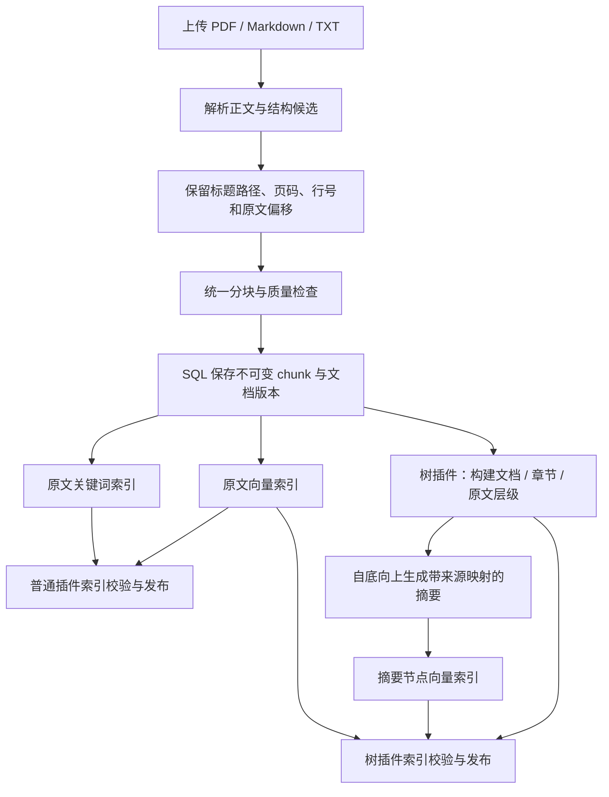
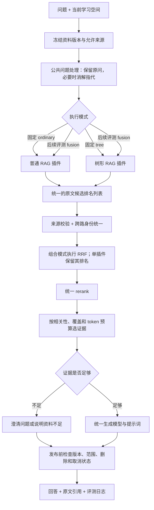

# KnowPath 可插拔 RAG 方案讨论稿

日期：2026-09-20。状态：设计讨论，不代表已经实现或确定树构建算法。

联网调研后，首版建议已调整为先验证文档结构和父子原文检索，再独立评测摘要节点。参见 [调研推荐稿](2026-09-20-tree-rag-recommendation.md)。本文保留为前一轮整体架构讨论。

## 1. 目标与决策顺序

先建立独立可运行、可对比的普通 RAG 和树形 RAG 插件，再用评测决定是否需要组合或自动路由。当前不恢复已删除的场景路由实现。
两套插件主要区别在候选来源的组织和召回方法；解析、原始 chunk、学习范围、融合、重排、生成和引用校验尽量复用。

三种树方案的取舍：

| 方案 | 优势 | 成本与限制 | 建议 |
|---|---|---|---|
| 文档结构树 | 章节含义明确、页码容易追溯、修改影响可定位 | PDF/TXT 标题识别质量影响树质量 | 首个树插件的推荐候选，待讨论确定 |
| RAPTOR 语义聚类摘要树 | 可把跨章节相关内容组织在一起 | 多层摘要、聚类参数、版本维护和范围隔离更复杂 | 后续独立插件或实验版本 |
| 邻接上下文扩展 | 构建成本低，可修复局部上下文断裂 | 没有多层摘要，不能等同完整树形 RAG | 作为单独消融实验 |

## 2. 离线建库

共同分块起点：优先保持标题、自然段、句子、列表、代码块的边界。初始目标可设为每块约 400～700 tokens，必要的相邻重叠约 50～100 tokens；这是待评测参数，不是已验证的最佳值。代码块和表格单独处理，超过预算再细分并保存来源偏移。短段可以按同节合并。
必须先修复当前 chunk.text[:6000] 截断：统一分块使每个索引片段完整可检索，不可让两套插件使用不同的截断版本。更换分块规则需要新 chunk profile、新索引和旧版本兼容，不能覆盖已绑定的来源。

格式处理：
- Markdown：提取原始标题层级；代码与公式保留。教材自定义标记单独识别，不作为正文知识点。
- PDF：优先用目录书签及可验证的标题布局；纯文本提取后以页码保留定位。无法可靠恢复章节的页面作为显式 page_group，不伪造语义章节。扫描页标记不支持，不能静默当空白。
- TXT：识别明确篇章标题；未识别时保留段落或固定窗口分组并标记结构质量。

首轮人工核查三份资料的标题、正文和代表性页面。树质量不合格时，评测记录 unavailable 或使用标注的结构回退版本，不能把普通检索结果计作树插件成功。

## 3. 树节点与存储

示例：文档根摘要 → 食物储存章节摘要 → 冷藏/冷冻小节摘要 → 原文 chunk。
根摘要由章节摘要生成，章节摘要由其原文或下层摘要生成。摘要保留关键条件、数值、例外；每条摘要事实映射到 child_node_ids 或最终 leaf_chunk_ids。程序能检查引用 ID，事实是否被原文支持仍需抽查或专门校验。

建议树节点字段：node_id、document_version_id、tree_version、parent_id、node_type、level、section_path、child_ids、正文/摘要、content_hash、summary_model_profile、summary_prompt_version、structure_quality。
节点 ID 应包含文档版本、完整层级路径及同名节点的位置身份，不能只按标题文本去重。

SQL 保存原文、树节点、父子边和构建状态，是事实来源。Qdrant 保存叶子和摘要节点向量，建议分 collection/profile 便于独立管理。关键词索引可用 Qdrant sparse/BM25 或独立实现，需先核对当前服务版本和中文分词能力，不能把现有中文单字匹配直接叫 BM25。
现有 Neo4j 学习知识图谱继续表达概念/前置关系。文档树表达内容归属，两者可关联，首轮不合并为同一套节点身份。

发布以 material_version + chunk_profile + tree_profile + embedding_profile 的构建清单为单位。普通和树索引分别记录 readiness；新树未完成不能伪装为已就绪，也不应阻止已完整建好的普通插件运行。
修改原文产生新版本，自底向上重建受影响摘要；旧学习空间仍使用绑定的旧版本。删除资料清理原文派生索引、树节点、摘要及缓存，复用现有 outbox、版本检查和删除隔离机制。

## 4. 在线链路

问题处理是公共步骤，第一轮可关闭改写以单独比较召回；多轮实验中，两套插件必须收到同一个改写问题及相同历史。历史只用于理解问题，不能替代原文证据。

### 普通 RAG 插件

query → 关键词召回 + 原文向量召回 → 插件内部 RRF → 输出一份去重后的原文候选排名。
这代表待建设的混合普通 RAG。当前代码仍是 keyword/qdrant 二选一，应保留当前版本作为额外 baseline。
插件不自行生成最终回答，不自己定最终的引用列表。

### 树形 RAG 插件（以结构树为例）

query → 多层摘要节点召回 → 选择相关章节分支 → 在分支允许的后代原文中检索 → 输出有序原文候选。
不必须从根逐级下钻；直接检索各层摘要可减少一次上层错误导致整条路径丢失。
摘要只引导定位，首轮最终生成使用原文证据。叶子节点分支召回可复用相同关键词和向量检索能力。
限制命中父节点数、每分支后代候选数和总候选预算；不能把整章所有子块作为同分候选无差别展开。父摘要可以缓存允许后代 ID，但子块仍按查询相关性排序。

后续“tree + direct_leaf”实验可加一条直接原文召回通道，不过应明确标为组合版本，不能与纯 tree 混为一谈。
若要让摘要也进入生成上下文，应单独增加实验项，记录 derived_context=true、原始证据映射和摘要 token 占比；不可冒充原文引用。

### 公共融合与重排

RRF 融合的是对同一 leaf_chunk_id 的排名。普通插件内部融合关键词与向量；树插件先把摘要命中映射为经查询排序的原文候选，并完成内部融合。两者共享 RRF 工具实现，但各自输出一份去重排名。只有组合模式才在插件输出之间再执行一次 RRF；单插件直接进入公共 rerank。
RRF 公式：score(d) = Σ w_i / (k + rank_i(d))。rank 从 1 开始，k=60 可作为实验初值，权重需在开发集校准。
每个通道先按 chunk ID 去重，同一候选在单个通道只投一次。树的多个层级或多个父摘要不能无上限重复投票；应在树插件内部聚合成一个有界、去重的原文排名，再与普通插件融合。
召回分数和 rerank 分数不直接混加；embedding 余弦分数不等于回答可信度。

融合后统一 rerank，再作覆盖/去重/预算选择。候选数量、最终 token 预算对两套插件相同；排序模型、embedding 和生成模型同版本。

### 范围安全

摘要节点可用的前提是其所有来源后代都在当前允许集合内，即 descendants(node) ⊆ allowed_chunks。
若章节的一部分被排除，不可使用包含这些内容的整章摘要；向下选择完全允许的子节点或原文叶子。该限制应在摘要召回之前生效，不能只在回答引用时过滤。
复用当前绑定版本和主题排除逻辑。所有候选回到 SQL 权威原文校验，模型调用后再次检查范围版本、取消和删除状态。

## 5. 插件契约

逻辑上采用两个独立可注册插件，首版无需引入外部分发/动态安装系统。

| 接口 | 输入 | 输出 |
|---|---|---|
| prepare | 不可变原文快照、索引配置、任务上下文 | 索引构建清单与 readiness |
| retrieve | 原问题/公共改写问题、允许 chunk 集合、固定版本、检索预算 | 一份去重的原文候选排名 + trace |
| delete | 被删除的资料/版本/profile | 清理回执 |
| close | 无 | 释放插件自有资源 |

RetrievalRequest：query、original_query、scope_snapshot_id、allowed_chunk_ids、material_versions、plugin_version、candidate_budget、deadline。
Candidate：chunk_id、material_version_id、channel、rank、raw_score、parent_node_ids。正文由公共层取权威副本。
RetrievalResult：ranked_candidates、status、error_code、index_profile、trace（耗时、调用数、候选数量、路由/回退记录）。
最终候选和可选派生摘要必须分字段。首版不返回派生摘要。
接口不要求普通插件理解树；树插件也不自行绕过范围检查。共享缓存以版本/profile/query 为键，避免过期向量或摘要混用。

实验模式先提供 ordinary/tree 的固定选择。树未就绪时直接记录 tree_unavailable；在线后续允许显式降级并记录实际插件，离线评测不得静默计作树结果。

## 6. 评测设计

先用桌面的三份资料建立约 60 道人工核验题，每份约 20 道。覆盖事实、解释、概览、比较、连续追问、资料无答案/超范围问题。文档主题不同，因此不得用一份文件测试普通、另一份测试树，或直接据此宣称某格式更好。
每题保存原文页码/行号/偏移、必需证据、答案要点、允许范围、可回答性。标注原文位置，运行时再映射 chunk ID，避免更换分块后标签失效。
开发集与保留测试集按题目家族划分；同义改写不要跨两边泄漏。模型生成题目只能作草稿，证据和答案必须人工核验。公开教材可能在训练集中，增加无答案/范围限制与少量有明确标记的受控事实样本，防止仅凭预训练知识答对。

实验组分阶段添加，避免一次改变多个因素：

| 组 | 目的 |
|---|---|
| A0 当前 keyword 或 vector 配置 | 保留项目历史基线，报告实际使用的模式 |
| A1 改善后的统一分块 + 原文混合检索 + RRF + rerank | 建立合理普通 RAG 对照 |
| B1 同一分块 + 结构树引导的原文检索 + 相同公共处理 | 衡量树的独立增益 |
| B0 结构/标题定位后检索叶子，不生成摘要 | 与 B1 比较，隔离摘要的收益 |
| B2 A1 + 邻接/父节原文扩展 | 判断收益是否只来自更多上下文 |
| C A1 + B1 合并召回 | 判断是否互补，报告额外成本 |
| D 评测后设计的自动路由 | 判断是否以较低成本接近 C，不能先凭规则断定更优 |

首轮交付 A1/B1；其他组按结果追加。
固定生成模型、提示词、最终 token 预算、重排模型、共享查询处理，记录不同插件的内部检索成本。对比同预算质量，同时给出质量与成本关系，而不假设两条路径成本相等。
建议起始预算：每个插件总召回候选约 40～60，公共重排候选最多 40，最终原文上下文 4000～6000 tokens；数值与当前配置核对后在开发集调整。不能给 tree 的最终提示更多 token 却把收益归因树结构。

记录证据 Recall@K、nDCG/MRR（局部问题）、预算裁剪前后证据覆盖率、所需要点覆盖率（概览/比较）、答案正确性、引用支持率、无答案拒答与可回答题误拒率、多轮指代成功率、P50/P95 延迟、单问成本与离线构建成本。
保存 query、实际插件、profile、候选排名、RRF 和 rerank 结果、最终证据、回答、费用与阶段耗时。模型评分只能辅助筛选，关键结论人工复核；模型即使温度设为 0 也可能波动，必要时重复运行并报告区间。
60 题仅为探索基线，不能代表全场景泛化；当前全部样本可用于初步比较，长期选择应增加未见文档与题型。

## 7. 后续路由（在比较之后）

路由识别任务粒度和问题范围，执行普通/树形/组合，而不是强制二选一。
初始假设：事实普通优先、概览树优先、复杂比较组合、指代由公共前处理解决。不确定时用评测证明更稳的默认策略。
只有证据表明路由有收益才接入；路由错误率、降级次数和实际策略都入日志。缺少树时在线可显式回到普通，已注册策略的服务失败必须按配置处理，不允许隐瞒失败。

## 8. 建议实施顺序

1. 确认树类型与插件边界；核验三份资料的解析质量。
2. 共同原文分块/profile/证据定位，以及 A1 普通 RAG；构建评测集。
3. 实现独立的 B1 树插件、摘要来源映射和范围安全。
4. 固定模式运行 A1/B1，查看逐题错误归因：解析、召回、重排、生成、引用。
5. 有互补证据再增加 C 组合，最后讨论 D 路由及上线默认模式。

本稿是讨论方案，尚未实施。
