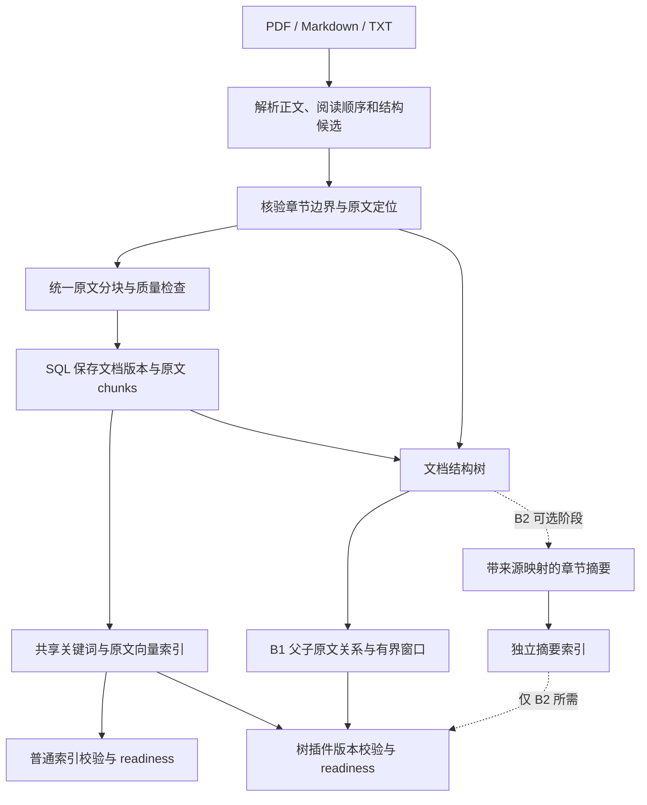
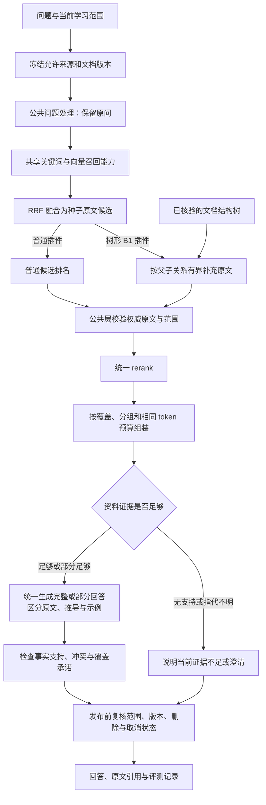
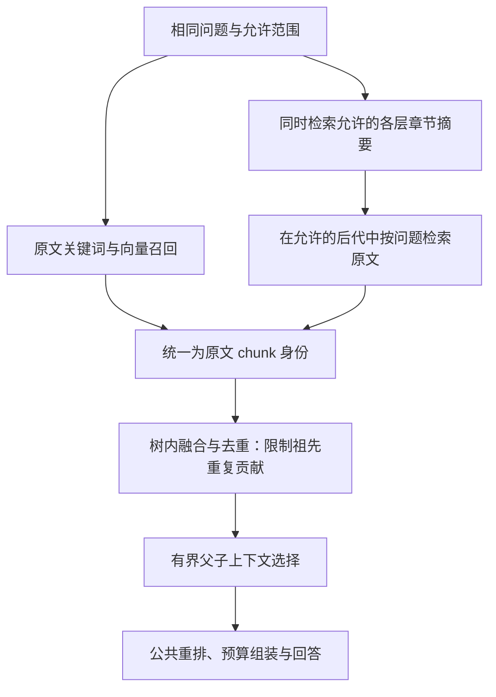
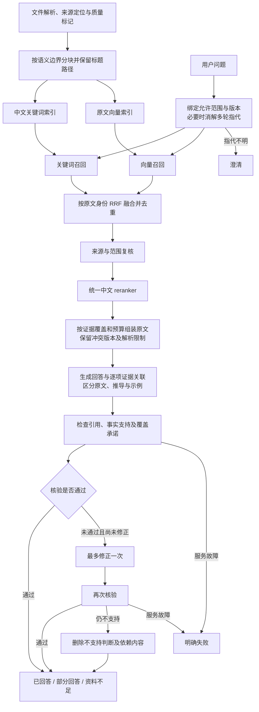

# KnowPath 可插拔 RAG 整体设计与实施计划 v1.1

> 状态：设计与产品边界已确认，工程执行计划已补充，A/B1 工程能力已实现，80次真实开发请求已完成（30次正常返回、50次失败，配置尚未通过验收；后续诊断见实施记录）。2026-09-20，用户确认质量与证据可追溯优先、语义分块、普通混合 RAG、分阶段树插件、第 10.9 节行为边界及四项工程建议。模型选型和具体数值由开发集评测确定。项目原稿与桌面原路径同步维护；桌面文件名沿用 v1.0，内容为 v1.1。
>
> 执行说明：本文件记录已确认的整体设计、分阶段任务与验收要求。2026-09-20 已按用户确认的四项建议补充[工程执行计划](2026-09-20-pluggable-rag-execution-plan.md)，落实算法规则、版本迁移、五批开发任务与验收选择标准；实现时使用 `executing-plans`，如用户选择委派再使用 `subagent-driven-development`。用户随后已授权持续实现；工程结果和剩余人工验收依赖见文末。

**日期：** 2026-09-20。

**目标：** 建立两套可独立运行、可公平评测的普通 RAG 和树形 RAG 插件，通过真实模型回答质量与成本数据决定最终采用的方案。

**架构：** 两套插件共享可追溯的原文、语义分块、范围与版本约束，以及重排、上下文组装、回答生成和支持性检查。普通插件采用 BM25＋向量召回、RRF 融合；树插件首版增加文档结构和有界父子上下文检索，章节摘要跨层检索作为独立增强实验。

**技术基础与候选：** 复用项目 Python 后端、SQL、Qdrant 和任务机制；简单文本 PDF 先验证现有提取器，复杂结构按需要对照 Docling、MinerU。BM25 实现、中文分词器及 reranker 型号通过实测选择；embedding 与生成模型以现有支持配置为实验起点，具体版本和参数在运行记录中冻结。设计描述不等同于验收通过，实际交付以文末实现记录为准。

---

## 1. 决策状态与本稿范围

| 类别 | 内容 | 当前状态 |
|---|---|---|
| 项目目标 | 先建立两套可插拔 RAG，再按数据选择 | 用户已明确 |
| 优化优先级 | 回答质量与证据可追溯优先，同时记录速度和成本 | 用户已明确 |
| 路由 | 已撤销此前路由；以后是否重建由评测决定 | 当前不实现 |
| 树的首版形态 | 文档结构树＋共享原文召回＋有界父子原文上下文 | 已纳入首版设计，收益由评测验证 |
| 摘要树 | 在首版之后单独验证章节摘要跨层召回 | 可选增强 |
| 普通 RAG | 语义分块＋BM25/向量混合召回＋RRF＋重排＋原文支持检查 | 首版方案已确认 |
| 回答边界 | 原文、推导与示例区分；范围、冲突、覆盖与解析质量约束 | 第 10.9 节已全部确认 |
| 参数与解析器 | 采用候选配置开展实测后选择 | 交由技术验证，不作为待用户确认项 |
| 文档交付 | 项目内保留维护原稿，桌面保存同版完整副本 | 本轮完成整理与导出 |

本稿整合前一轮总体架构与最新联网调研。发生冲突时，以本稿中的最新阶段划分为准：B1 不生成摘要，B2 增加摘要导航，B3 才研究摘要参与生成。旧稿中的“首版默认递归摘要”和旧实验编号不再作为本稿定义。

设计确认与代码交付分别记录。后续已实现 A/B1 与共享链路，并在独立环境执行追加迁移、真实服务验证和开发评测；人工质量验收与最终选择仍须按本文门槛完成。

## 2. 核心判断与路线选择

第一步应研究并验证可靠的文档结构，重点是章节边界、阅读顺序和原文定位。树形 RAG 不只有一种树：

| 路线 | 树的来源 | 适用价值 | 主要限制 | 本项目安排 |
|---|---|---|---|---|
| 文档结构树与父子检索 | 文档、章节、小节、原文块的归属关系 | 补全定义、条件、例外和局部上下文，便于引用追溯 | 依赖结构解析质量，不保证概览问题必然改善 | 推荐首版 |
| RAPTOR 语义摘要树 | 原文分块后做语义软聚类和递归摘要 | 组织跨章节语义，提供高层信息入口 | 建树与更新成本、摘要误差、范围隔离复杂度增加 | 后续独立对照 |
| PageIndex 文档树检索 | 构建文档层次并通过模型推理定位内容 | 可借鉴结构定位后读取原文的方式 | 本地格式支持、解析能力和基准覆盖有限，额外模型调用需测量 | 后续独立对照 |

这里的树是内容关系，不是向量数据库内部的索引数据结构。SQL 可以保存树的父子关系，Qdrant 可以继续索引原文或摘要；无需为了文档树新增图数据库。

不把从根逐层下钻设为唯一入口。RAPTOR 原论文比较了逐层遍历和跨层检索，在其对比条件下后者更好，主实验使用跨层方式。该结果支持保留跨层与原文直达入口，但不能保证在本项目中文材料上的收益。

目前推荐的是与 KnowPath 约束相符、可逐步验证的方案，不宣称已经证明它是所有场景的最优方案。

## 3. 现有样本与结构解析研究

### 3.1 设计阶段的原始解析检查

2026-09-20 根据用户对复杂排版的反馈，首轮材料调整为：37 页《中华人民共和国未成年人保护法（2024年修正版）》PDF、线性代数 Markdown、简体《论语》TXT。新 PDF 为简体、单栏文字，来自上海市城市管理行政执法局公开附件，比此前约 40～50 页的偏好稍短；原 44 页繁体食物安全 PDF 留作复杂排版样本。

新 PDF 已验证 37/37 页可提取文字、页面尺寸一致、图像 XObject 数为 0；全部页面渲染缩略图均为单栏正文。9 章、132 条的文本编号顺序完整。项目实际 `MaterialParser` 输出 37 个片段、每个 148～623 字符，但 `section_path` 仍为空，尚未恢复章条层级；跨页条文仍可能被拆开。该结果是资料与解析检查，不是回答质量评测。

此前检查的食物安全 PDF 没有可直接使用的书签目录，`pypdf` 顶层 outline 数量为 0。它存在印刷目录，但文本提取顺序为第一章、第三章、第六章、第五章、第二章、第四章，且标题与页码分列。此项历史检查保留，用于后续复杂排版对照。

因此“能够提取文字”不等于“已经恢复正确结构”。这个发现说明需要核验版面与阅读顺序，不代表任何候选解析器已经解决问题。

### 3.2 各格式解析策略

| 格式 | 建树方式 | 保留内容与定位 | 质量不足时的处理 |
|---|---|---|---|
| Markdown | 按标题语法层级解析 | 标题路径、原文偏移；代码、公式、列表边界 | 记录无法识别的结构，避免把教材标记当正文 |
| TXT | 识别明确篇章标题；《论语》可形成书→篇→章句 | 原文区间、顺序和篇章名称 | 使用显式段落组或窗口，不能仅凭空行伪造标题 |
| PDF | 综合书签、印刷目录、阅读顺序、标题块与正文锚点 | 物理页码、印刷页码、文本块位置、表格关系 | 使用明确标记的页组/窗口；扫描页需要 OCR 或标记不可用，不能静默丢弃 |

LLM 可以辅助提出标题和层级候选，但实际节点必须关联可验证的原文位置。对模型提议的结构记录来源与质量，不能用模型编造的标题冒充文档原有章节。

### 3.3 解析器验证安排

1. 首轮核验新 PDF 的九章、132 条边界和物理页码，重点处理跨页条文；它没有可依赖的印刷页码。原食物安全 PDF 的六章、目录错序与表格作为后续复杂排版检查。
2. 核对 Markdown 的标题与公式、代码边界，以及 TXT 的篇章层级。
3. 首轮保留现有 pypdf 为正文提取基线；评估结构解析或复杂排版能力时，在相同页面上比较 pypdf 与 Docling，记录结构、正文、表格和来源定位的实际表现。
4. 若首个候选不足，再使用相同核验集对照 MinerU，按准确性、资源消耗和集成成本选择。

Docling、MinerU 尚未在这批样本上完成对照测试，本稿不预先宣布胜者。首轮结构核验同时形成可回查的正确结构样本。

## 4. 两插件共享的数据基础

### 4.1 共同原文与分块

两套插件使用相同文档版本、规范化正文、叶子 chunk、embedding 和关键词分词配置。不能给树插件更完整的正文，却让普通插件继续使用截断内容。

每个 chunk 区分：

- `source_text`：用于引用的原始正文。
- `retrieval_text`：用于索引的文本，可包含确定性的文档标题、章节路径和正文。

两套插件都使用相同标题前缀，避免把单独给予树插件的元数据优势归因于树。标题前缀不等于 Anthropic Contextual Retrieval 中通过模型生成的上下文描述。

分块优先保持自然边界。表格保留表头、行列关系和来源；代码块、公式与列表不随意截断。过长章节可添加 `context_window` 中间节点，明确它是检索窗口，不伪造新的语义小节。

现有检索与索引中的 `text[:6000]` 截断需要在后续实现时核查并消除信息丢失。分块变更产生新的 profile 和索引版本，旧来源绑定保持可回溯。

### 4.2 实验起点，而非定案参数

| 参数 | 当前建议起点 | 决定方式 |
|---|---|---|
| 叶子块长度 | 语义单元优先，不设硬性最小长度 | 300～600 tokens 仅为早期观察范围，不作为切点或强制区间；超长上限结合实际模型输入能力评测 |
| 父级上下文窗口 | 约 1200～1800 tokens | 按局部上下文收益与噪声评估 |
| 总召回候选 | 约 40～60 个/插件 | 在开发集控制和校准，两插件遵循相同实验预算 |
| 公共重排候选 | 最多约 40 个 | 按重排开销与证据覆盖调整 |
| 最终原文上下文 | 约 4000～6000 tokens | 匹配实际生成模型，两组保持一致 |
| RRF 平滑常数 | 可从 k=60 起试 | 开发集验证，不默认是最佳值 |

候选数、重排预算和最终 token 预算都应受控；额外检索调用量另行记录。不得让树插件使用更长上下文或更多未披露调用，再把收益全部解释为结构优势。

## 5. 离线建库流程



B1 发布不依赖摘要任务。B2 的摘要索引需单独完成校验并发布，不能将部分构建完成的索引标记为完整可用。

## 6. B1：文档结构树与有界父子原文检索

结构示例：

```text
文档
└── 章节
    └── 小节
        ├── 原文 chunk 1
        ├── 原文 chunk 2
        └── 原文 chunk 3
```

首版不依赖模型摘要。建议流程：

1. 使用与普通插件相同的关键词与向量召回，内部通过 RRF 获得种子原文候选。
2. 根据真实 `parent_id` 分组，检查命中在同一小节的集中程度及父级覆盖。
3. 在允许的同节原文内补充相关邻接内容，限制父级窗口、每个父级候选数和总候选数。
4. 输出去重后的原文叶子候选，并保留父级分组、命中来源和原文定位。
5. 公共重排与上下文组装根据相关性、证据覆盖和预算作选择，所有实际输入回答模型的内容都有来源。

例子：命中“食品冷藏要求”中的一段后，通过小节关系补充前文的适用条件，减少只取到结论、漏掉条件的情况。

父级命中不代表自动加载整章；LlamaIndex 的默认子节点占比阈值 0.5 仅是框架默认值，不直接当作本项目策略。上下文组装应保留必要条件和例外，同时防止低相关父级文本挤出其他证据。

B1 验证的是结构关系和上下文选择的作用。它主要针对局部上下文断裂，不承诺自动改善整篇概览或跨文档比较。

首轮执行 profile 采用最多 30 个种子＋10 个扩展候选，每父节点最多扩展 3 个；扩展不足以普通候选补足，与 A 最多 40 个重排候选对齐。扩展依据为同小节的明确条件/例外、续文或相关邻接关系，不因共父节点就加载全部后代。这些数值只作为开发集起点。公共上下文层按结论与必要条件组成证据组，缺少必要条件时不得发布依赖它的完整结论。详细顺序与边界见工程执行计划第 2 节。

## 7. 在线链路与插件边界

以下普通、树形两条分支用于固定插件对照；不是根据问题自动分类的路由，也不表示每次同时执行两条路径。



单轮检索基准关闭问题改写，以隔离召回因素；多轮指代由公共层处理，两插件接收同一个改写问题和相同历史。无法可靠消解时澄清，历史用于理解问题，不自动作为来源证据。

### 7.1 插件职责

采用逻辑上可注册的独立插件，首版不引入外部动态安装系统。职责与输入输出按下表确定，具体函数签名在实施前按项目约定冻结：

| 接口 | 输入 | 输出 |
|---|---|---|
| `prepare` | 不可变原文快照、索引配置、任务上下文 | 构建清单与可用状态 |
| `retrieve` | 原问/公共处理后的问题、允许来源、固定版本、预算与截止时间 | 一份去重的原文候选排名与 trace |
| `delete` | 删除的资料、版本或 profile | 派生内容清理回执 |
| `close` | 资源关闭请求 | 释放插件自有资源 |

请求记录 `query`、`original_query`、`scope_snapshot_id`、允许的 chunk 集合、资料版本、插件版本、候选预算和 deadline。允许集合可使用服务端范围句柄表达，最终必须绑定同一不可变范围。

候选记录 `chunk_id`、资料版本、来源通道、排名、原始分数和父节点 ID。正文由公共层读取权威副本，不能直接信任插件返回的任意正文。

结果记录候选排名、状态、错误码、索引 profile 与 trace。B1、B2 只提供原文候选；将来 B3 的派生摘要必须使用独立字段，不能冒充原文。

插件不各自生成最终回答或决定最终引用。公共层统一来源检查、重排、上下文组装、生成与引用处理。

证据充分性按问题所需答案要点及其支持跨度判断，不用相似度阈值代替。生成后输出支持/不支持/无法判定的逐结论核验；最多修正一次，并对修正版再次核验。仍未通过的结论及其依赖内容删除，返回有支持的部分或证据不足。核验服务故障明确失败，不算资料无答案；未经核验正文不发布为最终回答。

### 7.2 RRF 与 rerank 的顺序

推荐基本顺序：多路召回 → RRF 合并排名 → rerank 精排 → 上下文组装。

RRF 融合的是同一原文身份的排名，公式为 `score(d) = Σ w_i / (k + rank_i(d))`，排名从 1 开始。关键词与向量通道先按 `chunk_id` 去重，每个候选在每个通道只计一次。

普通插件内部融合关键词与向量；树插件在把摘要路径等转换为原文候选后完成内部融合。两插件可以共享 RRF 实现，但输出各自的一份排名；单插件调用没有必要再做一次无意义的跨插件 RRF。

只有将来专门评测组合模式时，才考虑在两插件输出间融合。章节 ID 与原文 chunk ID 不能直接做 RRF，embedding 分数、RRF 分数和 rerank 分数也不能随意相加或当成回答可信度。

## 8. B2 与 B3：摘要能力的独立增强

### 8.1 B2：章节摘要只用于检索导航

当 B1 仍在概览、跨段综合问题上明显漏证据时，按需要为章节或小节生成摘要，保留来源叶子 ID、摘要模型和提示词版本。



保留原文直达通道，不要求所有查询从根逐层向下。摘要命中后不能无差别展开整章，仍按查询相关性选择原文并限制候选预算。

同一原文可能由多个祖先摘要找到，要聚合并限制重复贡献，避免树越深就得到越多重复票数。不同通道先归一到 `leaf_chunk_id` 后再融合。

B2 明确是结构树与原文直达组合的树插件。与普通基线比较时披露额外检索与摘要构建成本，不将它描述为没有额外预算的纯树遍历。

摘要在本阶段是派生索引和定位线索，最终回答仍依据原文。

### 8.2 B3：可追溯摘要参与生成

只有独立实验才允许摘要进入最终上下文：记录 `derived_context=true`、来源映射和摘要 token 占比，并维持相同总上下文预算。

程序验证来源 ID 存在，不等于摘要内容获得事实支持。摘要事实仍需原文支持检查和人工抽查，不能以模型生成文字替代原文引用。

## 9. 存储、版本、范围与异常处理

### 9.1 数据与生命周期

SQL 为原文和文档结构的权威来源，建议记录：`node_id`、`parent_id`、节点类型、完整路径、文档版本、原文位置/叶子集合、结构来源与质量、`tree_profile`。摘要另记内容 hash、`summary_profile`、模型/提示词版本和证据映射。

节点身份依赖文档版本、完整路径与位置，不能只靠标题去重。同名章节在不同文档或不同位置不能错误合并。

Qdrant 保存原文和摘要向量，按 collection 或 profile 区分。关键词通道使用 BM25，具体存储依第 10.4 节验证，不能把现有单字匹配直接称为 BM25。现有 Neo4j 学习图谱继续表达概念、前置与相关关系，与文档归属树保持不同身份。

代码核对发现当前向量点身份还包含 `graph_version`，独立索引命令使用固定图版本 1。共享叶子索引的设计必须明确文本索引与学习图谱快照的关系，处理正文未变但图版本变化的情况；不能为了复用向量就直接移除现有版本和范围隔离。

采用原文版本、检索版本、学习范围快照三层身份。通过“旧图谱来源 → 可核验原文跨度 → 新 chunk”映射解耦，`graph_version` 继续约束学习范围。新 chunk 全部跨度必须落在允许区间内，混入排除章节时首版整块拒绝；不同解析产物的 offset 不直接比较。新旧索引并存，旧引用仍按原身份解析且受当前访问限制。构建校验后事务发布，每请求固定清单；回滚不得恢复已删除或撤权内容。迁移表、文件与步骤见工程执行计划第 3、4 节。

构建清单绑定资料版本以及解析、分块、树、摘要、embedding 等 profile。普通与各树阶段分别记录 readiness；发布前核验完整版本，避免新旧索引混用。

原文更新产生新版本；只重建受影响的结构与派生摘要。旧学习空间保留其绑定版本。资料删除应清理原文派生索引、树节点、摘要和缓存，复用项目现有任务与可见性机制。

### 9.2 允许范围是检索边界

父级扩展只读取当前允许的原文。摘要可用的条件是其全部来源都在当前允许集合内，即 `descendants(node) ⊆ allowed_chunks`，且版本一致。

部分章节被排除时，不能使用包含排除内容的整章摘要；改用完全允许的子节点或叶子。相关约束在召回和外部模型调用之前执行，不能只在最终引用阶段补过滤。

候选返回后从 SQL 核验权威来源；回答发布前再检查版本、删除、取消和范围变化。缓存绑定范围、版本、profile 和问题，避免跨范围或跨版本复用。

### 9.3 失败与降级必须可见

树未建好时返回明确不可用状态；不能把普通插件结果计为树插件成功。未来线上若允许降级，必须明确配置并记录实际执行插件，离线评测单独统计。

解析缺失、摘要构建失败、索引不可用、重排/生成超时等分阶段记录。重试与超时由公共配置统一设置并受总 deadline 限制，按真实服务验证参数。证据不足时说明当前证据限制，不用模型常识补齐成有来源的答案。

## 10. 普通 RAG 首版方案（已确认）

用户已选择回答质量与证据可追溯优先，并确认采用本节方案与第 10.9 节行为边界。延迟和费用仍作为验收指标记录；实现库、模型型号及参数由验证确定，不将计划中的设计描述为已实现能力。

### 10.1 定位与原有 A0 实现的差距

普通插件应能独立服务 KnowPath 的资料问答、解释和学习辅导。推荐它在线执行平面的原文 chunk 检索，解析阶段同样识别章节、条款及代码/公式边界。利用结构分块和保留标题路径，不等于在线执行树检索；树 B1 额外通过父子关系扩展原文，B2 再增加摘要导航。

现有代码已经提供来源快照、版本与学习范围检查、上下文预算、模型适配和引用身份校验。需要补齐的是自然边界分块、真正的中文关键词检索、混合融合、独立重排、证据完整性选择，以及无答案/部分回答契约。

原有 A0 关键词按中文单字及英文词的出现数量排序，不能称为 BM25；keyword/qdrant 二选一，没有 RRF 和 rerank。检索只使用当前原始 message，历史在回答阶段可见，尚未解决检索前的指代消歧。旧配置保留为 A0 历史参考。

| 路线 | 能力与代价 | 当前安排 |
|---|---|---|
| 单路向量检索 | 简单，专有名词、编号和精确匹配可能不足 | 历史或消融对照 |
| 混合检索＋重排 | 同时利用准确词项与语义，能逐阶段归因 | 已确定的普通插件首版 |
| 多查询/HyDE/问题分解/循环检索 | 可能改善复杂问题，增加漂移、调用与评测因素 | 发现具体失败类型后独立验证 |

### 10.2 普通插件整体链路



从来源复核到回答检查属于共享能力，树插件采用相同实现与预算。检索前就在允许范围内筛选，图中的复核不替代前置约束。

### 10.3 分块：保留完整语义与原文定位

第一步将页面上的文本整理为可回溯的逻辑段落，根据标题、条款、定义及其条件和例外识别完整语义单元；仅当单元超过输入上限时再细分。普通、树插件共享这一份叶子版本。语义关系决定在哪里切，token 用于模型输入上限与预算计量，不按固定 token 数机械切块。

| 格式 | 推荐分块单位 | 主要边界 |
|---|---|---|
| 新 PDF 法规 | 章→条→款中的完整内容 | 合并同一条款的跨页续文；超长条款按款、句拆分 |
| Markdown 教材 | 小节内完整概念段落 | 公式与解释、代码与必要说明保持关联 |
| TXT | 篇章与完整章句/段落 | 不能把相邻但语义不同的章句强行拼成大块 |

不设硬性最小长度，不为了凑到 300～600 tokens 拼接无关条文，也不因达到该范围就拆开定义、条件和例外。该数值仅保留为早期长度分布的观察参考。超长语义单元优先按款、段落、句子做有界拆分，必要时从约 50～80 tokens 的相邻重叠起试。自然独立条款不默认重叠，避免重复排名和提示浪费。最大长度需考虑 embedding/reranker 的实际输入限制、标题前缀和上下文预算，并通过检索质量评测选择。

首轮采用结构辅助的语义分块：利用文档已有章条、段落及定义/条件关系确定边界。基于 embedding 距离或 LLM 的自动语义切分作为结构模糊材料的候选增强，不默认认为相似度突变就是正确切点；“但是，以下情况除外”等转折内容仍可能必须与前文保持关联。

清理可识别的页眉页脚、恢复段内换行，但不删除编号、条件、否定、数值或单位。跨页合并要保留多段 `source_spans`，能够把每一部分映射回原文页和文本位置，不能只给整个 chunk 标一个起始页。

当前 `SourceChunk` 的单一 page 和已有 chunk 身份用于来源绑定，不能原地覆盖。分块升级应形成新 profile、新来源映射和索引清单，保持旧版本学习记录可追溯；具体迁移方式在实现计划中细化。

原文引用使用 `source_text`；embedding、BM25 和重排使用可追溯的 `retrieval_text`（文档名＋章节路径＋正文）。两插件共享这种输入。消除固定 `text[:6000]` 截断造成的隐性信息损失。

### 10.4 关键词与向量通道

中文关键词通道采用真正的 BM25。首轮评估中文分词加术语词典，同时保留英文标识符、公式符号、条款编号、数值及单位；分词和编号归一化规则需要版本化，在写索引与查问题时一致应用。归一化文本只用于检索，不改写引用正文。

问题“第七十二条规定了什么”主要依赖编号匹配；“平台怎样保护儿童隐私”则需要语义相关性。两路并行能够覆盖不同措辞，但最终收益仍需评测。

首轮三份材料规模较小，可用按范围和版本缓存的本地 BM25 索引快照开展对照，避免每个问题都重新构建。接口独立于实际存储；需要服务端稀疏索引时，再核验 Qdrant 能力并迁移。项目部署文件固定 Qdrant v1.13.6，不直接假定它支持任何最新文档中的默认 BM25 或中文处理方案。

为了减少同时变化的因素，第一轮建议复用项目已支持的 `text-embedding-v3 / 1024` 及 `qwen-plus` 作为嵌入与生成起点，记录实际配置；这是实验控制，不是对型号最优性的结论。更换 embedding 需要独立的新索引 profile。

所有通道都在当前允许来源内搜索。关键词无匹配时允许返回空列表；向量排名靠前不等于存在足够证据，不通过强制凑满 Top-K 来判断可回答性。

### 10.5 融合与重排

建议开发集起点：关键词 Top-30、向量 Top-30，RRF 融合、身份去重后最多 40 个候选进入重排。最终实际预算与第 4.2 节一起调整。

原有对话 service 对检索返回有 1～8 条的限制，并检查来源字典与原始白名单一致。新 A/B1 链路已将候选排名/分数放进独立结果对象，再由公共层取得权威正文和处理空结果；旧入口保留原契约，不能通过向原来源字典追加评分字段绕过检查。

首轮 RRF 可以从等权、k=60 起步。每通道内部先去重，同一 chunk 的两路命中保留排名和来源供解释；不直接相加 BM25 分数与余弦相似度。

重排采用独立的中文相关性模型接口，输入相同问题、标题路径和原文候选。可先评估现有供应商的重排服务，也可与本地中文/多语重排模型对照；实际型号、接口、最大输入长度和可用性需要验证后选定。不能假定兼容聊天 API 就自动支持 rerank，也不能将聊天模型自由输出的排序当作未经校验的重排结果。

重排选择与问题相关的证据，未被召回的原文无法由它补回。因此先测召回覆盖，再判断重排收益；用少量标注问题校准阈值，不使用“0.7 以上就可信”之类固定规则。

### 10.6 上下文组装与多轮问题

按相关性和证据覆盖选择片段，优先保留回答所需的定义、条件、例外和比较两侧证据。合并高度重叠的引用区间，但不因文字相似就把不同版本或不同来源的证据身份抹去。最终片段数随问题与块长度变化，不固定永远取前八条。

原文上下文预算从约 4000～6000 tokens 起试，这是完整模型输入中的一部分；还需预留问题、系统约束、历史和回答输出空间。token 计数应验证对实际模型的适配性。预算不足时仅从完全允许的块中选择完整证据组或显式可定位、保留必要条件与例外的摘录；混有排除内容的块仍整块拒绝，不直接把首段按字符截半并沿用完整片段的引用范围。

指代消歧放在公共问题处理层。例如上一问讨论“学校发现学生欺凌”，下一问“那应该通知谁”，检索前可改写成包含明确主语的独立查询；原问、改写及所用历史都保留在 trace 中。无法确定指代就澄清，不能猜出新的事实或扩大资料范围。

单轮检索基准先关闭改写；多轮实验两插件使用相同的公共改写。历史回答、记忆摘要用于理解上下文，不当作本轮外部资料的事实证据。首轮不默认加 HyDE、多查询生成或循环检索。

### 10.7 回答、引用与资料不足

统一结果状态如下；服务失败不属于资料不足：

| 状态 | 回答行为 | 引用要求 |
|---|---|---|
| 已回答（answered） | 给出资料支持的结论及必要条件 | 关键事实逐项关联实际原文证据 |
| 部分回答（partial） | 回答已支持的部分并明确缺失信息 | 已回答事实有引用，缺失部分不编造引用 |
| 资料不足（insufficient） | 说明当前检索证据不足；未经全范围检查不宣称文档没有答案 | 允许空引用，不强迫引用无关片段 |
| 澄清（clarify） | 关键指代不明时先澄清，不猜测问题对象 | 无资料事实时允许空引用 |
| 服务失败（failed） | 明确失败阶段并允许重试，不冒充无答案 | 不发布未经核验的最终回答 |

当前 `validate_answer` 强制非空 `citation_ids`，只检查引用身份而不验证正文是否支持答案。需要同时调整结果契约与上下游展示/发布逻辑，不能仅在提示词加“不要胡编”。

回答以关键判断或段落为粒度关联来源，内部记录对应原文跨度；前端可展示“第 X 章、第 Y 条、PDF 第 Z 页”。程序检查来源、版本、范围和位置，支持性核验检查条件、主体、数值、否定和例外是否与原文一致。

质量优先的首版对关键事实执行额外的原文支持检查。核验区分：直接陈述检查与原文是否一致；推导检查前提是否有来源、推理是否成立且保留适用条件；构造示例检查是否明确标注、是否符合所引用定义或规则。示例不要求逐字出现在原文中，也不能冒称真实案例。若采用模型辅助核验，核验者只看到本轮实际提供的证据，记录额外调用及判断；它是有误差的检查手段，不能作为绝对正确的裁判。发现不支持的判断时最多修正一次，修正后必须再次核验；仍缺证据则删去该判断及其依赖内容，或返回部分回答/资料不足。核验服务故障明确报错。

允许范围内来源冲突时保留双方原文、版本及适用条件，明确呈现分歧；不得由相似度、重排分数或发布日期单独裁决权威性。对“当前规定”类问题，缺少有效时效依据时说明无法从现有绑定资料确认，不把固定资料快照当作现行规定。

每轮记录目标资料范围、解析完整性及实际证据覆盖范围。依靠局部命中只能给出相应范围的概括；“全部、唯一、不存在”等结论须具备与问题范围相符的覆盖核验。覆盖记录不等同于答案一定正确，未验证完整覆盖时不得作穷尽承诺。

生成前的证据不足检查、回答后的支持检查都不能保证全库不存在答案；评测还需区分真正无答案与检索漏证据造成的误拒。普通、树方案使用相同的生成和核验流程，并保留核验前后的答案，便于定位改进来自哪个阶段。

延续项目已有的校验后发布模式，发布前再次复核范围、绑定版本、取消和删除状态。原文、用户问题和对话历史均作为不可信输入，不作为系统指令。

### 10.8 失败与评测安排

资料无答案、检索索引未就绪和外部服务故障必须区分。正式 A/B 评测不静默降级；BM25、向量、重排或核验任一阶段故障，标注失败阶段和实际执行链路，不能计作完整普通/树实验的成功样本。

质量优先的线上首版清楚报告阶段失败并允许重试，默认不静默降级。若以后提供降级，必须显式配置并记录实际链路，不能把没有重排或没有核验的结果当成同一配置的成功样本。具体超时与重试次数按真实服务验证，在统一 deadline 内执行；返回可理解的错误类型，不暴露内部异常或凭据。

普通插件自身也要做消融：向量单路、BM25 单路、混合融合、混合融合＋重排；必要时比较回答支持检查前后的结果。它们是普通方案内部的实验配置，不是自动路由。

项目对活动测验提示有不调用模型的既有确定性分支，这是产品约束。普通资料问答评测需排除或单独标记该分支，不将它的结果算作检索策略表现。

按第 11 节记录检索证据覆盖、预算裁剪后覆盖、正确性、引用支持、拒答/误拒、延迟和成本。核对页码与跨页映射、章节/条文是否丢失、多轮消歧是否偏离原问，以及更新/范围排除时的结果一致性。新 PDF 是一个格式简单的探索样本，不用它独自证明所有教材的处理能力。

### 10.9 已确认的产品边界

2026-09-20 用户明确要求全部按照建议写入计划。以下规则作为首版设计与验收约束，普通和树插件共同遵守。

| 边界 | 已确认规则 | 实现与验收含义 |
|---|---|---|
| 资料事实与推导/举例 | 允许依据资料作推导和构造示例，标注这是推导/示例；不自行加入资料外事实 | 原文支持推导前提，并不表示原文直接写出推导结论；示例不得伪装为真实事件或原文内容 |
| 检索范围与跨文档 | 允许综合当前学习范围内的多份已绑定资料，不能自动扩大到被排除章节、其他空间或互联网 | 不同资料各自保留证据身份；跨文档比较的各侧都要有来源 |
| 版本与资料冲突 | 以学习空间绑定的版本作答；多个允许来源相互冲突时并列呈现并引用 | 不让检索分数决定谁正确，也不只凭发布日期判断效力；明确版本与适用条件，固定资料快照不代表现行法律 |
| 证据不足与追问 | 能回答多少就回答多少；关键指代不明先澄清，无支持时说明“当前检索证据不足” | 一次 Top-K 没找到不等于整份文档一定没有，需评测误拒与漏召回 |
| 概览与完整性承诺 | 普通首版支持局部问答及有证据的综合，不默认承诺穷尽整篇所有要点 | 全篇总结/列出全部条目需独立验证覆盖策略；若覆盖不足，标明范围或请用户缩小问题，不能用少数命中块伪装全篇结果 |
| 解析质量与支持格式 | 首轮重点验证文字型 PDF、Markdown、TXT，保留公式/代码及来源；低质量页面明确标记 | 仅层级不确定时可使用已核验正文；正文、公式或表格关系缺失时只回答可靠部分，不能作全文否定或穷尽结论 |
| 服务故障与降级 | 评测不静默降级；质量优先的线上默认明确报错并可重试，若提供降级则显式记录 | 外部调用故障不同于资料无答案；降级结果不计入完整链路的同组成功样本 |

原文支持检查区分三类内容：资料直接陈述、基于已引用前提的推导、明确标注的构造示例。资料外事实与缺失前提不能通过贴一个相关引用变成有证据的结论。知识边界已经确认：允许有依据的推导和示例，不自行补充资料外事实，也不启用联网补知识。

实现与评测可逐步确定的事项包括：中文分词和编号规范、BM25 存储、实际 reranker 型号、超长块上限、重叠量、Top-K、RRF 权重以及支持检查实现。除非影响用户的部署环境、数据发送范围或费用限制，不要求用户逐个选择技术参数。所有自动模型步骤仍受候选、token、总调用和超时预算限制，质量优先不等于无限重试。

已确认的优化优先级、语义分块原则、普通首版链路与产品边界不因技术参数尚需实测而重新列为待用户确认项。后续如改变行为承诺，应明确记录修订；技术参数调整记录 profile 与评测依据。

普通方案改变共同基础时，必须同步校正树插件与实验预算，保持同数据、同范围、同公共处理的公平对照。

## 11. 真实模型评测方案

### 11.1 数据集与证据标注

第一轮建议约 60 道人工证据核验题，三份资料各约 20 道。覆盖事实定位、解释、概览、比较、连续追问，以及资料无答案/范围排除场景。

每题保存问题、允许范围、文档快照、原文页码/行号/偏移、必需证据、答案要点和可回答性。标签优先绑定原文位置，运行时映射 chunk ID，避免分块变化导致标签失效。

模型生成题目仅作为草稿，原文证据和答案需人工核验。开发集与保留测试集按问题家族拆分，同义改写不跨两组泄漏。

三份资料主题不同，不能用一份测试普通、另一份测试树，再据此判断方案或格式优劣。每组使用同一批问题和资料范围。自然适用的比较题用于测试，避免为凑题强行比较无关主题。

加入少量明确标记的证据受控样本与无答案题，检查模型是否实际依赖检索证据，避免公开资料上的记忆回答掩盖检索失败。

### 11.2 实验组的统一定义

| 组 | 配置 | 目的 |
|---|---|---|
| A0 | 项目当前 keyword 或 vector 版本，记录实际模式 | 保留历史参考，避免把共同基础改善归因于树 |
| A | 已确定的普通基线：共享语义叶子混合召回＋RRF＋公共 rerank 与回答检查 | 建立合理对照 |
| B1 | A 的共同基础＋有界父子原文上下文 | 分离文档结构本身的价值 |
| B2 | B1＋章节摘要跨层召回，摘要只定位原文 | 衡量摘要导航对概览、综合的增益 |
| B3（可选） | B2＋可追溯摘要参与生成 | 分离摘要作为回答上下文的收益与风险 |
| C（后续） | RAPTOR 或 PageIndex 的独立对照实现 | 验证不同树路线是否解决已发现的瓶颈 |

普通与树插件融合、自动路由属于结果驱动的后续实验，本稿不默认纳入首轮交付。

### 11.3 公平比较与评价指标

固定共享文档快照、分块、embedding、问题处理、reranker、生成模型、提示词和最终上下文 token 预算；控制候选与重排预算，披露额外查询和构建成本。

真实调用回答模型，分别记录：

- 检索：原文证据 Recall@K、局部定位的 MRR/nDCG、多证据覆盖，以及预算裁剪前后的证据覆盖。
- 回答：答案正确性、概览/比较要点覆盖、引用支持率与覆盖率、无答案拒答和有答案误拒、多轮指代效果。
- 成本与稳定性：P50/P95 延迟、每问模型调用与费用、索引构建与更新成本、解析/建索引失败比例。

不能用“模型答对了”单独证明检索有效，也不能用“引用 ID 存在”替代引用事实支持检查。当前引用存在性校验与上述证据支持率是不同层次。

每次运行保存问题、实际插件和版本、允许范围、候选及排名、RRF/rerank 结果、最终证据、回答、阶段耗时与费用，便于逐题重放。

按题型报告配对差异；小数据集的结论保留不确定性。模型评分只作辅助，关键结论人工复核；必要时重复运行，不能假定温度为 0 就完全确定。60 题是探索起点，长期选择还需要未见文档和问题类型。

首轮约 40 题开发、20 题保留，按问题家族划分；运行保留集前冻结评分规则、模型/profile、重复次数及费用/延迟数值门槛。主指标为“符合题目要求、关键结论有证据支持的任务成功率”，部分完成单列；服务失败计入全请求分母并另报失败率。固定硬约束场景须全部通过，违规阻断配置验收。B1 只有具备可复核的质量收益且成本满足预先确定的门槛时才考虑采用；配对差异和不确定性用于辅助判断；收益不明确暂用通过验收的 A，并补充未见资料。跨章节漏证据需排除公共链路问题后才进入 B2。具体统计与决策规则见工程执行计划第 5 节。

### 11.4 已确认边界的验收场景

以下场景同时覆盖普通与树插件。受控数据必须作为单独测试夹具标记，不修改官方原始资料；产品行为检查与检索、回答质量指标一并记录，不把一次模型正确输出当作全部场景已通过。

| 场景 | 输入条件 | 预期行为与核验重点 |
|---|---|---|
| 语义完整与跨页分块 | 某条文的条件在前页、例外在后页；另有一条很短但语义独立的定义 | 同一条文在输入限制内保持完整并记录多个原文跨度；短定义不为凑 token 与无关内容合并，超长条文按款句拆分且条件可追溯 |
| 推导、示例与外部事实 | 资料提供线性相关定义；用户要求构造例子并追问资料未包含的最新应用统计 | 可以构造并验证例子，标明“依据定义构造”，引用的是定义前提；统计部分说明证据不足，不用模型记忆补齐或冒称原文含有示例 |
| 跨资料与排除范围 | 问题需要当前范围内两份资料；另有被排除章节含容易命中的答案 | 综合允许来源并分别引用；排除内容不得进入召回结果、重排或回答模型，不能借摘要、历史记忆或缓存越界 |
| 冲突与旧版时效 | 两份允许资料表述冲突，一份注明旧版，但缺少完整生效、废止依据；用户问当前规定 | 并列说明内容、版本和出处；不凭排名或发布日期判定效力，不自动切换到范围外版本；说明无法据现有证据确认现行规定 |
| 未命中与穷尽结论 | Top-K 未召回某例外，而人工标签确认范围内其他原文包含它；用户要求列出全部例外 | 未验证全范围覆盖时只给有证据的部分并说明覆盖不足；不宣称不存在或已列全。评测记为漏召回，不能算正确的资料无答案 |
| 结构缺失与内容损坏 | 样本 A 正文及定位完整，仅层级不明；样本 B 缺页或公式符号丢失 | A 可基于可靠正文回答，标记结构不确定；B 的受损部分不作为完整证据，需要时部分回答或说明不足，不据此作完整推导或全文否定 |
| 追问与部分回答 | 上文指代明确或不明确；当前问题有两个子问，仅一个有支持 | 明确指代可由公共层消解且保留改写记录；不明确时澄清。支持的子问有来源，其他部分说明缺口；完全无支持可返回空引用 |
| 服务故障与发布状态 | 重排/核验服务失败，或生成过程中范围版本改变、资料删除、任务取消 | 故障与资料无答案分别记录，默认不静默降级；迟到或过期结果不得发布。评测记录失败阶段，不将失败请求隐藏或当作完整链路成功 |

实施中为每项保存对应输入快照、实际候选、最终证据、回答与判定依据。权限、版本、引用身份、状态和预算等确定性约束用自动检查验证；语义支持、推导有效性及概览完整性用人工核验样本配合模型辅助评分，报告错误类型和不确定性。

## 12. 分阶段计划与验收产物

以下为已确认设计对应的阶段任务。[工程执行计划](2026-09-20-pluggable-rag-execution-plan.md)已补充代码路径、接口契约、迁移步骤与各批验证命令，按“① 数据契约与迁移 → ② 解析建库 → ③ 普通 RAG → ④ 树形 B1 → ⑤ 对照评测”执行。新增模块、测试和 CLI 已实现并执行验证；模型和数值参数仍须通过开发集评估，并在保留集前冻结。

| 阶段 | 任务 | 验收产物与进入下一阶段的条件 |
|---|---|---|
| P0 设计整理 | 整合普通/树形方案、产品边界、接口、预算与评测 | 本版设计完成，桌面副本随实施进度更新；实际交付与评测见文末 |
| P1 结构研究 | 核验三份资料结构；对照 PDF 解析候选 | 原文定位与章节边界核验记录，明确可用结构和回退类型 |
| P2 共同基础与 A | 实现共享原文、语义分块、索引、范围、普通插件及回答检查；建立证据标注集 | 可独立运行的普通基线、固定数据快照、真实模型评测与第 11.4 节边界验收记录 |
| P3 树插件 B1 | 增加结构关系、有界父子扩展和独立可用状态 | 相同预算的 A/B1 报告，确认来源、范围、版本和成本可追溯 |
| P4 错误分析 | 逐题区分解析、召回、重排、预算组装、生成和引用错误 | 指明树有效的题型与尚未解决的瓶颈，决定是否进入 B2 |
| P5 可选增强 | 对确有需求的章节添加摘要导航，分别评测 B2/B3 | 证明增益与额外成本，不能将多项变更混为同一结论 |
| P6 最终选择 | 根据数据选择普通、树或组合；有必要再研究路由 | 默认方案与使用条件、质量成本依据及后续运行策略 |

当前文档工作清单：

- [x] 汇总最新树形 RAG 推荐路线和调研证据。
- [x] 写入结构研究、流程图、接口边界、版本范围和真实模型评测方案。
- [x] 明确已确认的产品边界与由技术验证确定的参数。
- [x] 与用户讨论并确定普通 RAG 首版方案和语义分块原则。
- [x] 统一校正两套方案的分块、接口职责、实验预算、实验组和阶段任务。
- [x] 将完整计划整理为 v1.0 并导出桌面，同版内容通过 SHA-256 核对。

阶段性的有效性验证包含：解析来源映射、允许范围与版本约束、索引生命周期、真实服务集成，以及真实模型回答评测。真实模型凭据、服务或数据缺失时，应明确记录阻塞项及其对结论的影响，不能把替身测试当作回答质量验证完成。

自动路由只有在两方案存在稳定、可预测的互补优势时才值得引入。如果一种方案在质量成本上持续占优，可以直接采用；不为保留两插件而强行设计路由。未来也应比较路由错误与维护成本，不预先把“事实走普通、概览走树”当成已证实规则。

## 13. 调研依据与证据边界

调研日期为 2026-09-20。以下是原始论文、官方参考或源码，具体实现版本需要在后续实验中固定。

1. [RAPTOR 原论文](https://arxiv.org/html/2401.18059v1)、[官方实现](https://github.com/parthsarthi03/raptor)：递归 embedding、软聚类与摘要；软聚类允许多个归属，因此不等同于文档目录树。跨层检索在论文特定对比条件下优于逐层遍历。论文摘要检查约 4% 含轻微幻觉，作者未观测到该实验问答的明显影响，不能外推为摘要无需证据校验。
2. [LangChain ParentDocumentRetriever](https://reference.langchain.com/python/langchain-classic/retrievers/parent_document_retriever/ParentDocumentRetriever)：检索小块，再按父 ID 获取较大原文。父级可为较大块，不必是整篇文档，也不依赖 LLM 摘要。
3. [LlamaIndex AutoMergingRetriever](https://github.com/run-llama/llama_index/blob/main/llama-index-core/llama_index/core/retrievers/auto_merging_retriever.py)、[HierarchicalNodeParser](https://github.com/run-llama/llama_index/blob/main/llama-index-core/llama_index/core/node_parser/relational/hierarchical.py)：叶子检索后按子节点覆盖合并父级；默认占比阈值不是最优参数证明。按大小建立层级也不等于恢复真实章节。
4. [Docling](https://github.com/docling-project/docling)、[结构与混合分块文档](https://docling-project.github.io/docling/concepts/chunking/)：提供文档结构、阅读顺序、表格和 OCR 等能力，支持基于结构再按 token 拆分/合并。是候选工具，尚无本项目中文样本对照结果。
5. [MinerU](https://github.com/opendatalab/MinerU)：作为必要时的解析对照候选，是否采用由实际样本验证决定。
6. [Anthropic Contextual Retrieval](https://www.anthropic.com/engineering/contextual-retrieval)：上下文增强索引配合关键词、向量和重排。文中 49%/67% 指其评测条件下检索失败率的相对下降，不是 KnowPath 回答准确率提高。
7. [PageIndex](https://github.com/VectifyAI/PageIndex)、[本地接口](https://github.com/VectifyAI/PageIndex/blob/main/pageindex/local_api.py)、[Flash 说明](https://pageindex.ai/blog/pageindex-flash)：当前本地能力包含索引、检索和聊天；本地统一接口仅接受 PDF，Markdown 另有脚本；本地 Flash 不执行 OCR，不能假设已经解决表格、图形或中文阅读顺序。
8. [PageIndex OSS Benchmark](https://github.com/VectifyAI/PageIndex-OSS-Benchmark)：62 题、34 份 PDF、1945 页，限定正文事实查找，排除表格、图片、算术及拒绝索引的文档。该成绩不能外推到本项目全场景。
9. [Mafin2.5 / FinanceBench](https://github.com/VectifyAI/Mafin2.5-FinanceBench)：98.7% 为特定完整系统在 FinanceBench 公开集上的结果，不是树索引自身的固有准确率。
10. [PageIndex Agent Integration](https://docs.pageindex.ai/sdk/agents)、[client 实现](https://github.com/VectifyAI/PageIndex/blob/main/pageindex/client.py)：Agent 的 `document_context` 只引导行为，不限制工具；内置本地 `chat(doc_id=...)` 有结构化允许列表。KnowPath 仍需自己落实用户范围和版本约束，不能笼统说整个工具有或没有范围控制。

## 14. 文档维护与交付

用户已授权持续实现。本稿维护整体设计，工程执行计划维护逐项状态；两者合并到桌面既有路径
`C:\Users\27202\Desktop\KnowPath-RAG整体设计与实施计划-v1.0.md`，文件名不变。
实现位于 `.worktrees/rag-foundation`、分支 `codex/rag-foundation`。

操作命令见 `docs/research/tree-rag/OPERATIONS.md`。开发集实测、人工质量验收与默认方案选择分开记录，
不将测试通过或模型自评支持当成人工正确率。以下首批记录保留为历史节点，当前状态见
[实施记录](../../research/tree-rag/IMPLEMENTATION-STATUS.md)。

## 2026-09-20 首批实施进度（历史记录）

已按修正后的计划开始实施，代码位于独立分支 `codex/rag-foundation`、项目内 `.worktrees/rag-foundation` 工作区。已实现数据/引用契约、原文范围映射、9 张追加表与迁移、不可变仓储、新旧引用和测验查阅审计桥接，以及删除事务兼容。最终相关回归 188 项通过、18 项跳过，包含 3 项真实 MySQL 临时库验证；10 道受控合成题的来源与划分校验通过。

这只是第一批基础实现。当前映射锚定旧解析 chunk，真实资料回填与新解析器映射、索引发布、普通 RAG 完整回答链路、B1 和真实模型对照仍待后续批次。现有业务库未迁移，在线检索未切换；上述开发复选框按完整批次验收保留未完成，不能将基础测试通过视为全部实施完成。

## 2026-09-21 续实施结果（当前状态）

最终学习/RAG回归：1265项通过、222项跳过、514项未选中；仅有一条既存依赖弃用警告。跳过不计为通过。

普通A、树形B1及共享基础已实现，包括语义分块、混合检索、真实重排、范围映射、版本发布/恢复、
一次修正及再次核验、引用回查、删除保护、调用/费用预算与真实对话接入。最后一轮补齐了运行时安全错误详情；
完整工程和测试证据见[实施记录](../../research/tree-rag/IMPLEMENTATION-STATUS.md)，操作见
[操作手册](../../research/tree-rag/OPERATIONS.md)。

40道开发题A/B1共80次真实请求已完成：30次正常返回、50次失败。预先指定的5道已见失败题采用
统一24k输入/4k输出再诊断，共10次中4次正常返回、6次失败。较大预算仍未解决服务可靠性；
正常返回不等于语义正确，不能据此宣布B1优胜或任一配置已验收。

60题人工标签、回答支持关系复核、开发配置完善、价格与四项部署门槛、保留集和最终选择尚未完成。
当前默认保留legacy；具体依据和后续前置工作见[当前采用决定](../../research/tree-rag/evaluation/decision.md)。
保留集未使用；原80次与10次诊断分别保留冻结代码、输入及全部失败，不用后续修复改写实验历史。
